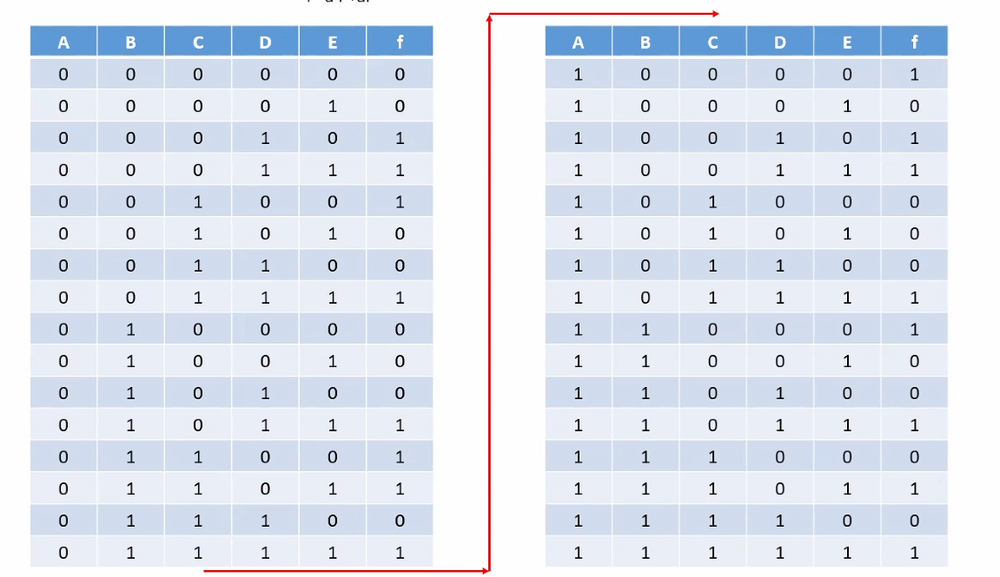
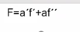
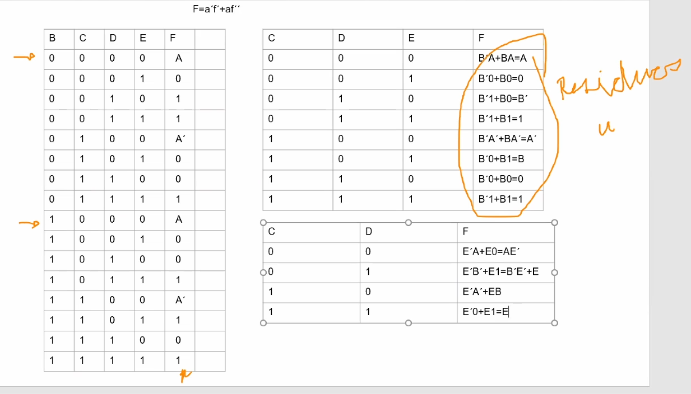
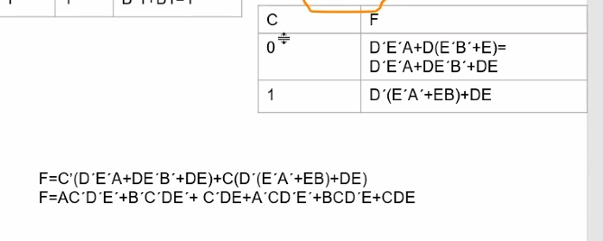
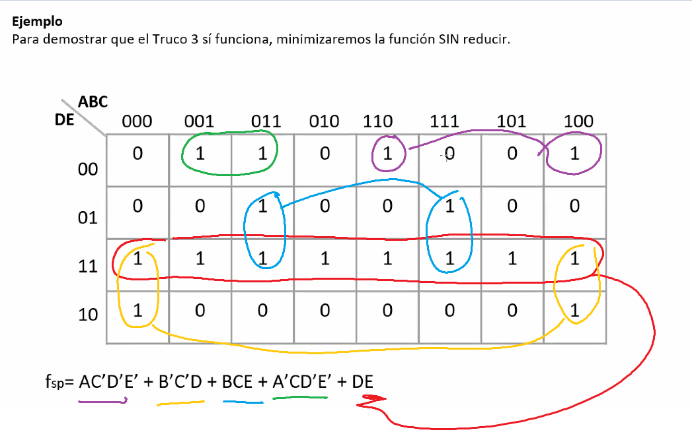
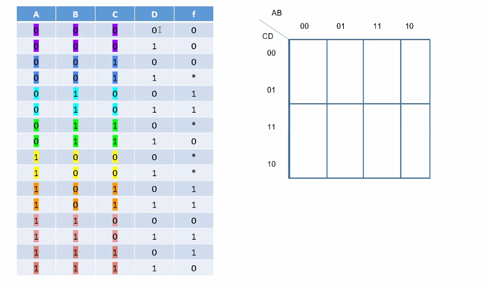
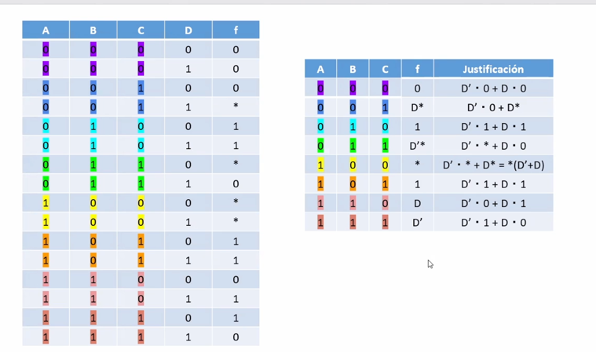
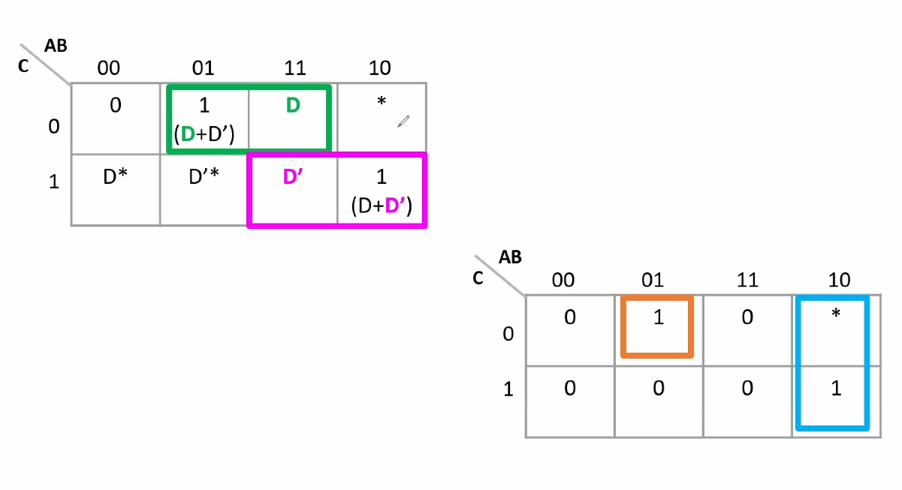
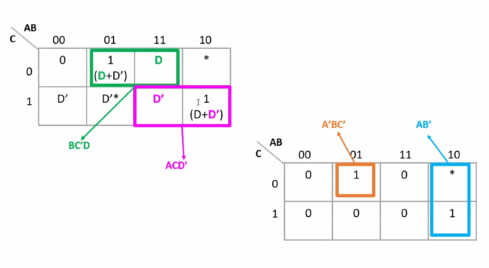
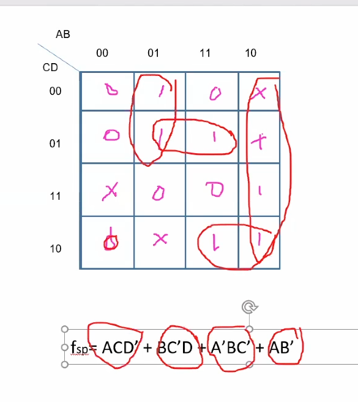

# Notas

## A5

- Al final muestra el proyecto 1
- 

# a5

FUNCIÓN  que se uso para simplificar

|  B   | C    | D    | E    | f    |
| :--: | ---- | ---- | ---- | ---- |
|  0   | 0    | 0    | 0    | a    |
|  0   | 0    | 0    | 1    | 0    |
|  0   | 0    | 1    | 0    | 1    |
|  0   | 0    | 1    | 1    | 1    |
|  0   | 1    | 0    | 0    | a'   |
|  0   | 1    | 0    | 1    | 0    |
|  0   | 1    | 1    | 0    | 0    |
|  0   | 1    | 1    | 1    | 1    |
|  1   | 0    | 0    | 0    | A    |
|  1   | 0    | 0    | 1    | 0    |
|  1   | 0    | 1    | 0    | 0    |
|  1   | 0    | 1    | 1    | 1    |
|  1   | 1    | 0    | 0    | A'   |
|  1   | 1    | 0    | 1    | 1    |
|  1   | 1    | 1    | 0    | 0    |
|  1   | 1    | 1    | 1    | 1    |

segunda reducción

| C    | D    | E    | f    |
| ---- | ---- | ---- | ---- |
| 0    | 0    | 0    | A    |
| 0    | 0    | 1    | 0    |
| 0    | 0    | 0    | B'   |
| 0    | 0    | 1    | 1    |
| 1    | 1    | 0    | A'   |
| 1    | 1    | 1    | B    |
| 1    | 1    | 0    | 0    |
| 1    | 1    | 1    | 1    |

tercera reducción

| C    | D    | F        |
| ---- | ---- | -------- |
| 0    | 0    | AE'      |
| 0    | 1    | B'E+E    |
| 1    | 0    | E'A' +EB |
| 1    | 1    | E'0+E1=E |

COMPROBAR

REDUCCION

el resultado es la función en forma algebráica

295

| ab   | c 0  | 1    |
| ---- | ---- | ---- |
| 00   | 0    | D*   |
| 01   | 1    | D*   |
| 11   | D    | D'   |
| 10   | *    | 1    |

Minimización

comprobacion

**LLegamos hasta la 299	**

# a6

Se salta de la 299 a 338

Ve a la c8 2:21 hrs 

C9 termina en la 363

**c10** empieza en 364
