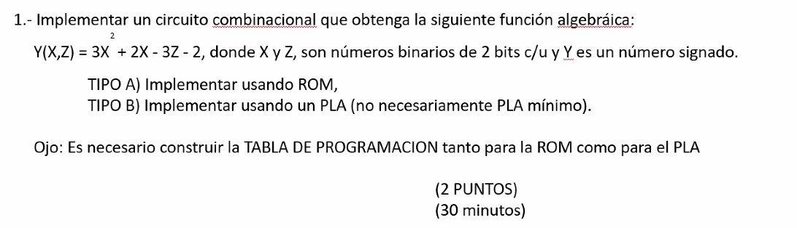
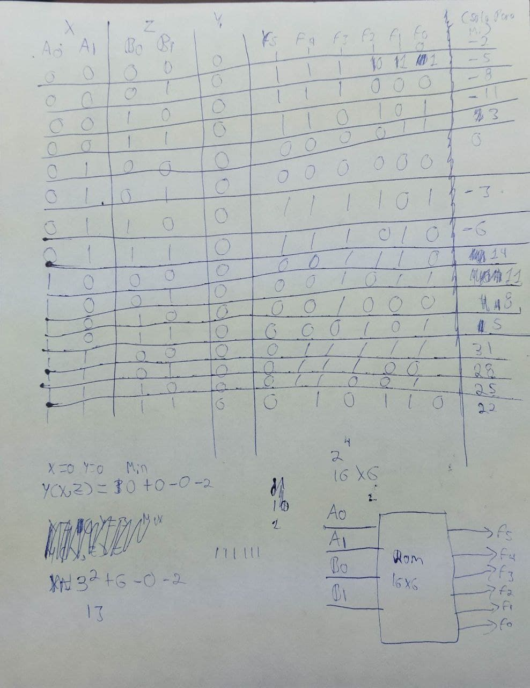
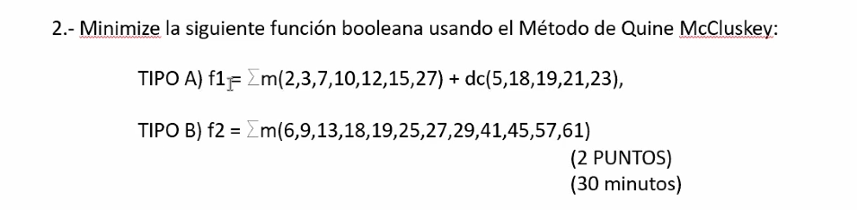
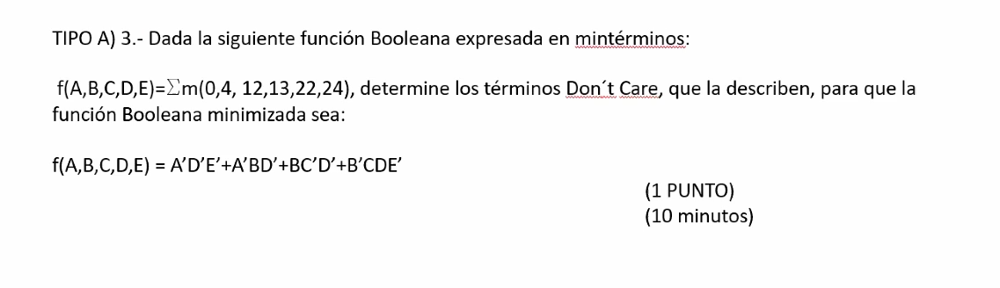
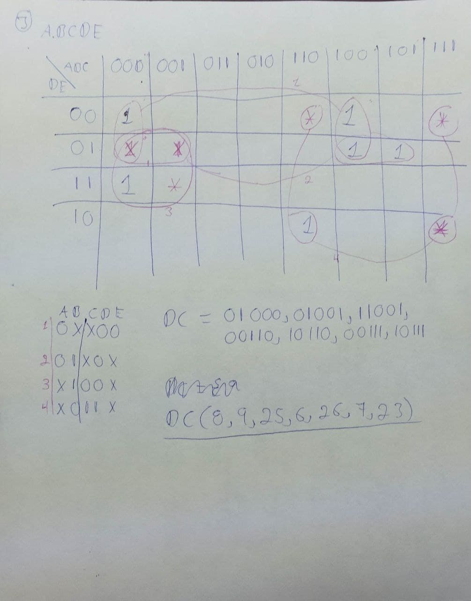
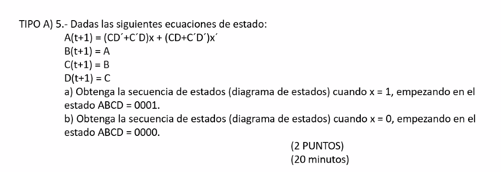
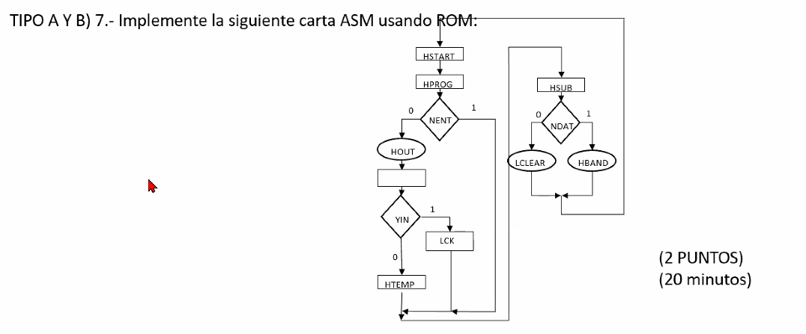

```
Examen: Primer examen final
Profesor: Ing. Roberto mandujano Wild
Materia: Diseño digital moderno
Nombre Alumno: Barrera Peña Víctor Miguel
```

<!--1645 Diseño digital
18/12/2021 -->

# Problema 1



## Solución



# Problema 2




## Solución

`````

 Tabla de minimizaciones 
 
-------------------------------------------------------------------------------------
│generacion 	|indice     	| bits       	| miniterminos                   	|
-------------------------------------------------------------------------------------
│0          	│ 1          	│ 00010      	│ 2                              	│
│0          	│ 2          	│ 00011      	│ 3                              	│
│0          	│ 3          	│ 00111      	│ 7                              	│
│0          	│ 2          	│ 01010      	│ 10                             	│
│0          	│ 2          	│ 01100      	│ 12                             	│
│0          	│ 4          	│ 01111      	│ 15                             	│
│0          	│ 4          	│ 11011      	│ 27                             	│
│0          	│ 2          	│ 00101      	│ 5                              	│
│0          	│ 2          	│ 10010      	│ 18                             	│
│0          	│ 3          	│ 10011      	│ 19                             	│
│0          	│ 3          	│ 10101      	│ 21                             	│
│0          	│ 4          	│ 10111      	│ 23                             	│
-------------------------------------------------------------------------------------
│1          	│ 1          	│ 0001-      	│ 2,3                            	│
│1          	│ 1          	│ 0-010      	│ 2,10                           	│
│1          	│ 1          	│ -0010      	│ 2,18                           	│
│1          	│ 2          	│ 00-11      	│ 3,7                            	│
│1          	│ 2          	│ -0011      	│ 3,19                           	│
│1          	│ 2          	│ 001-1      	│ 5,7                            	│
│1          	│ 2          	│ -0101      	│ 5,21                           	│
│1          	│ 2          	│ 1001-      	│ 18,19                          	│
│1          	│ 3          	│ 0-111      	│ 7,15                           	│
│1          	│ 3          	│ -0111      	│ 7,23                           	│
│1          	│ 3          	│ 1-011      	│ 19,27                          	│
│1          	│ 3          	│ 10-11      	│ 19,23                          	│
│1          	│ 3          	│ 101-1      	│ 21,23                          	│
-------------------------------------------------------------------------------------
│2          	│ 1          	│ -001-      	│ 2,3,18,19                      	│
│2          	│ 2          	│ -0-11      	│ 3,7,19,23                      	│
│2          	│ 2          	│ -01-1      	│ 5,7,21,23                      	│
└-----------------------------------------------------------------------------------┘

Tabla de implicaciones 
┌───────────────────────────────────────────────────────────────────────────────┐
│ Implicante primo              │2  │3  │7  │10 │12 │15 │27 │5  │18 │19 │21 │23 │
├───────────────────────────────────────────────────────────────────────────────┤
│ 5,7,21,23                     │0  │0  │1  │0  │0  │0  │0  │1  │0  │0  │1  │1  │
│ 3,7,19,23                     │0  │1  │1  │0  │0  │0  │0  │0  │0  │1  │0  │1  │
│ 2,3,18,19                     │1  │1  │0  │0  │0  │0  │0  │0  │1  │1  │0  │0  │
│ 19,27                         │0  │0  │0  │0  │0  │0  │1  │0  │0  │1  │0  │0  │
│ 7,15                          │0  │0  │1  │0  │0  │1  │0  │0  │0  │0  │0  │0  │
│ 2,10                          │1  │0  │0  │1  │0  │0  │0  │0  │0  │0  │0  │0  │
│ 12                            │0  │0  │0  │0  │1  │0  │0  │0  │0  │0  │0  │0  │
└───────────────────────────────────────────────────────────────────────────────┘

 Miniterminos Resultado
┌───────────────────────────────────────────────────────────────────────────────────┐
|generacion 	│ indice     	│ bits       	│ miniterminos                   	│
├───────────────────────────────────────────────────────────────────────────────────┤
│1          	│ 1          	│ 0-010      	│ 2,10                           	│
│0          	│ 2          	│ 01100      	│ 12                             	│
│1          	│ 3          	│ 0-111      	│ 7,15                           	│
│1          	│ 3          	│ 1-011      	│ 19,27                          	│
│2          	│ 2          	│ -01-1      	│ 5,7,21,23                      	│
│2          	│ 1          	│ -001-      	│ 2,3,18,19                      	│
│2          	│ 2          	│ -0-11      	│ 3,7,19,23                      	│
└───────────────────────────────────────────────────────────────────────────────────┘


 fsp=A'C'DE' + A'BCD'E' + A'CDE + AC'DE + B'CE + B'C'D + B'DE
`````


# Problema 3



## Solución



# Problema 4

## solución


# Problema 5



## solución


# Problema 6



## solución


# Problema 7

## solución


# Problema 8

## solución


