Proyecto 1. Función Booleana con compuertas NAND y NOR

Alumno: 

- Barrera Peña Víctor Miguel

Grupo: 6

Ciudad universitaria, Ciudad de México

# Introducción

# Desarrollo

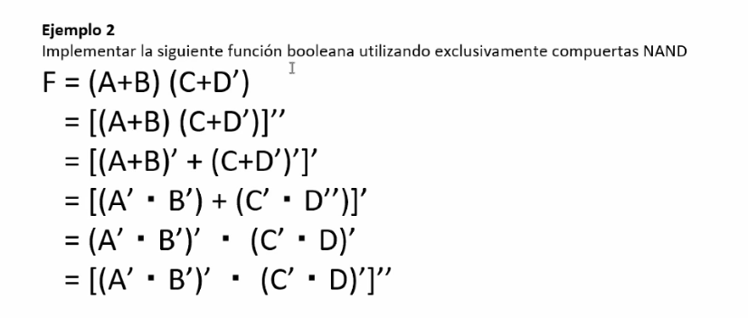

con nands y nors

## NAND

### Álgebra de Boole

Convertiremos al función original en una función únicamente compuesta sólo por NAND´S.

Forma objetivo $f=\overline{XY} = \overline{X} + \overline{Y}$
$$
\begin{aligned}
	f(A,B,C,D) &= (A+B)(C+\overline{D})\\
	f& =(\overline{\overline{(A+B)(C+\overline{D})}}) \\
	f&= \overline{\overline{(A+B)}+\overline{C+\overline{D}})} \\
	f&= \overline{(\overline{A} \cdot \overline{B})+(\overline{C} \cdot D)} \\
	\therefore f& =\overline{\overline{\overline{(\overline{A}\cdot \overline{B})} \cdot \overline{(\overline{C}\cdot D)}}}
\end{aligned}
$$

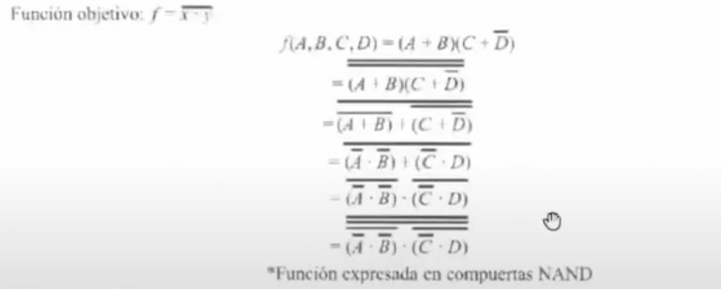

### Diagrama lógico

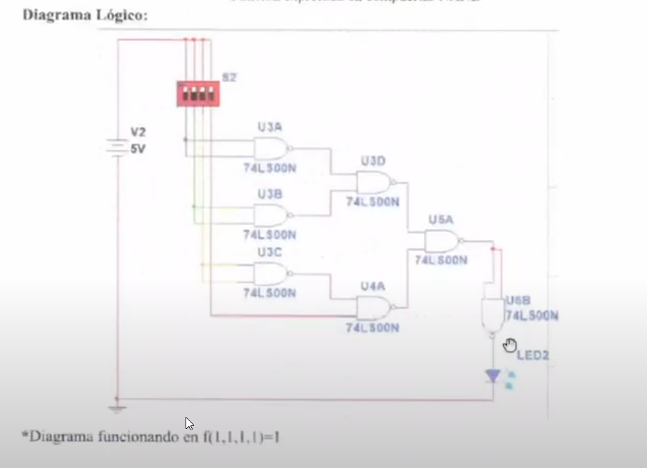

### Diagrama físico o patigrama

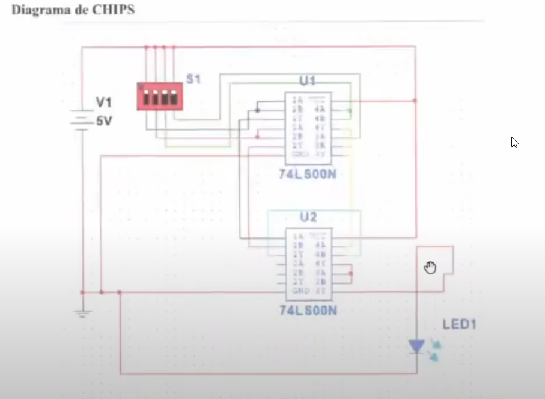

### Tabla de verdad

La función propuesta es la siguiente:
$$
f(A,B,C,D)= (A+B)(C+\overline{D})
$$

|  A   |  B   |  C   |  D   | $(A+B)(C+\overline{D})$ |      |
| :--: | :--: | :--: | :--: | ----------------------- | ---- |
|  0   |  0   |  0   |  0   | 0                       |      |
|  0   |  0   |  0   |  1   | 0                       |      |
|  0   |  0   |  1   |  0   | 0                       |      |
|  0   |  0   |  1   |  1   | 0                       |      |
|  0   |  1   |  0   |  0   | 1                       |      |
|  0   |  1   |  0   |  1   | 0                       |      |
|  0   |  1   |  1   |  0   | 1                       |      |
|  0   |  1   |  1   |  1   | 1                       |      |
|  1   |  0   |  0   |  0   | 1                       |      |
|  1   |  0   |  0   |  1   | 0                       |      |
|  1   |  0   |  1   |  0   | 1                       |      |
|  1   |  0   |  1   |  1   | 1                       |      |
|  1   |  1   |  0   |  0   | 1                       |      |
|  1   |  1   |  0   |  1   | 0                       |      |
|  1   |  1   |  1   |  0   | 1                       |      |
|  1   |  1   |  1   |  1   | 1                       |      |

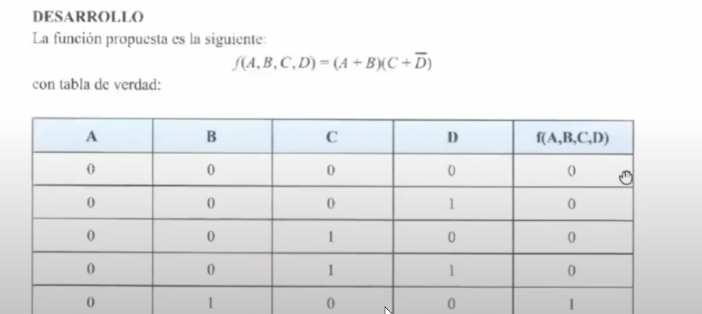

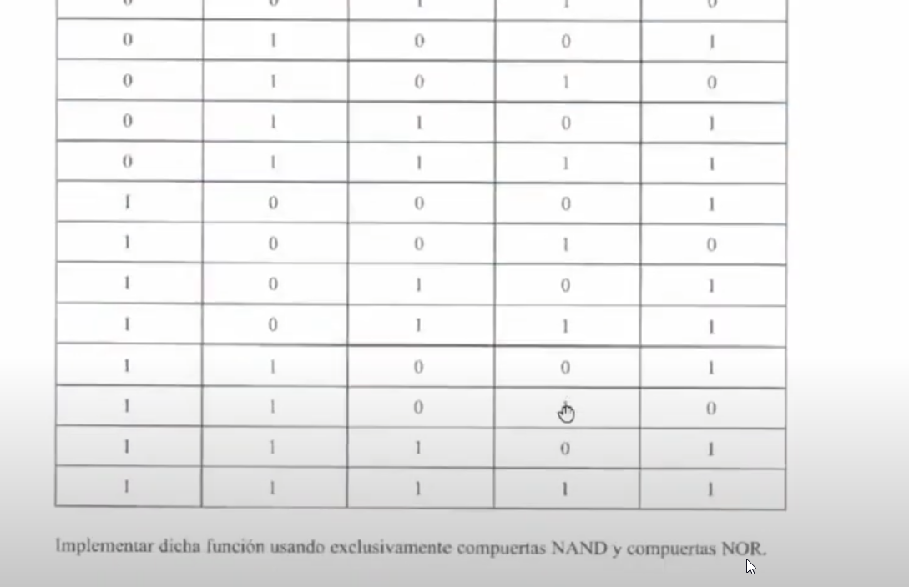

## NOR

### Álgebra de Boole

Forma esperada $f=\overline{X+Y}$

## Boole

$$
\begin{aligned}
 f(A,B,C,D) &= (A+B) (C+\overline{D}) \\
 &=\overline{\overline{(A+B)(C+\overline{D})}} \\
 &= \overline{\overline{(A+B)}+ \overline{C+\overline{D}}}
\end{aligned}
$$

### Diagrama Lógico

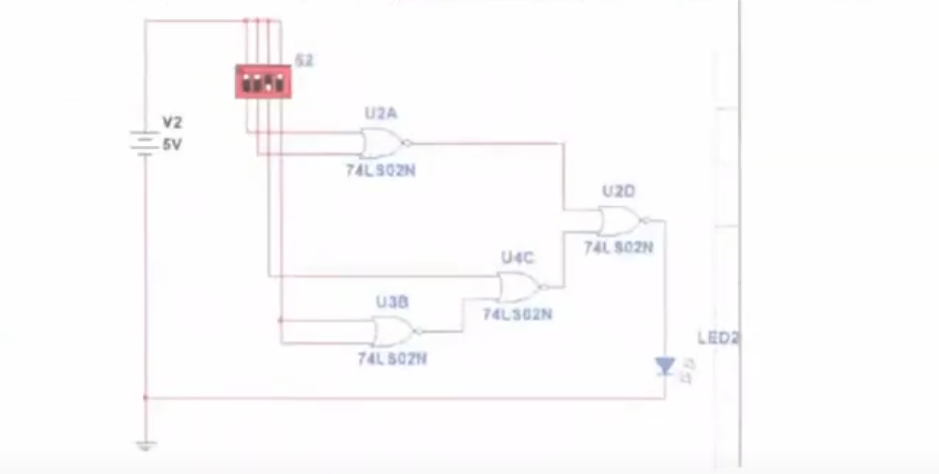

### Daigrama físico o patigrama

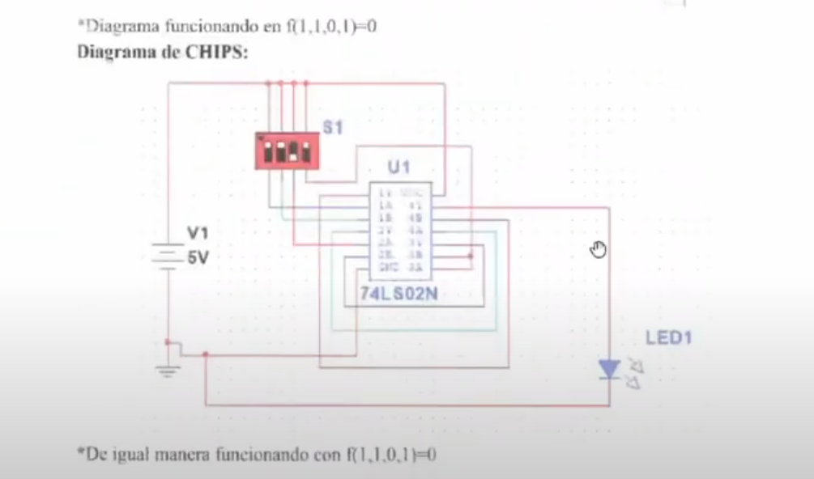

## Ensamblado Físico

Compuertas nand tfl 7400 (nand)

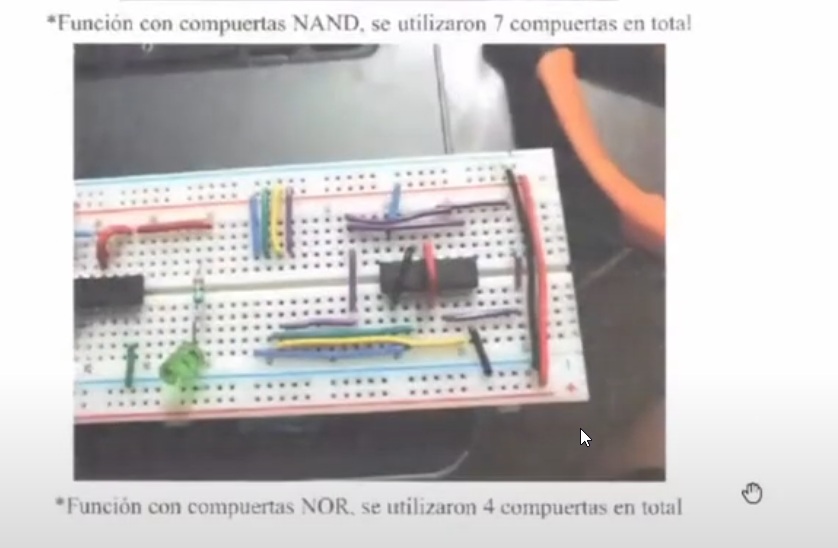

# Codigo Quartus

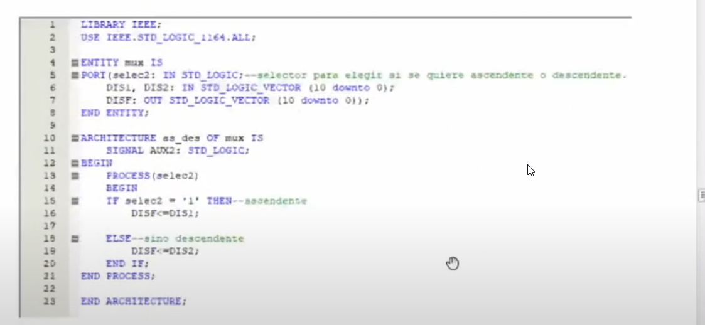

# Diagrama de bloques

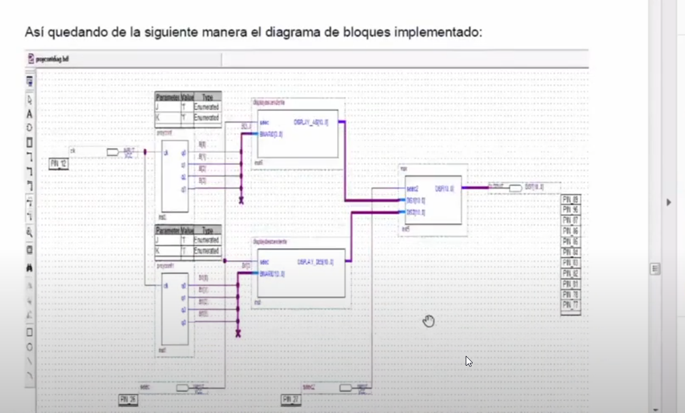

### Conclusión

Barrera Peña Victor Miguel

## Anexo

## Pasar entre compuertas

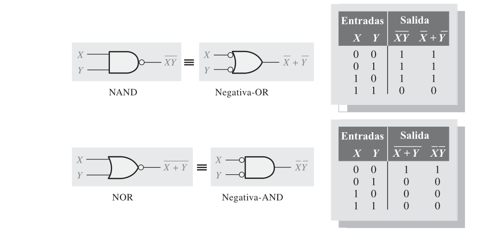

## Booleana NAND´s

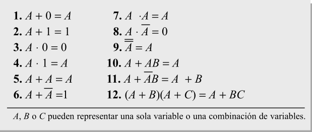

### Reglas álgebra de Boole

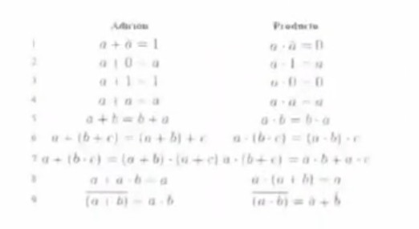

