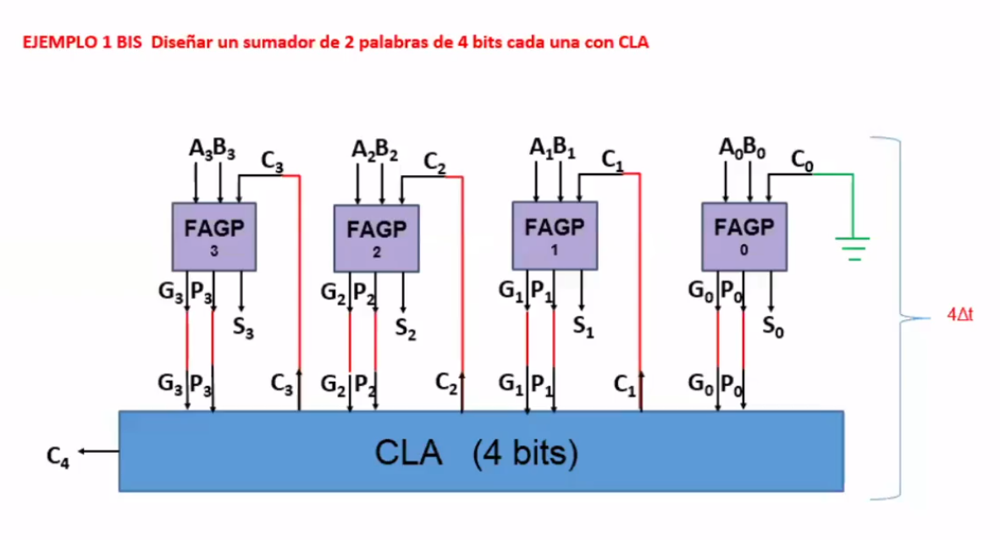
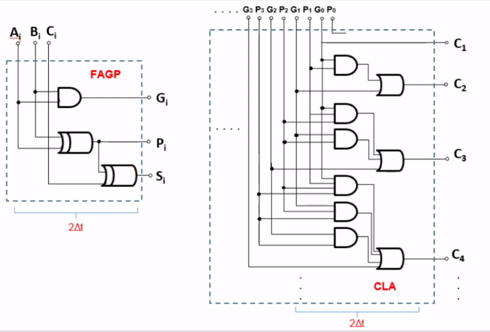
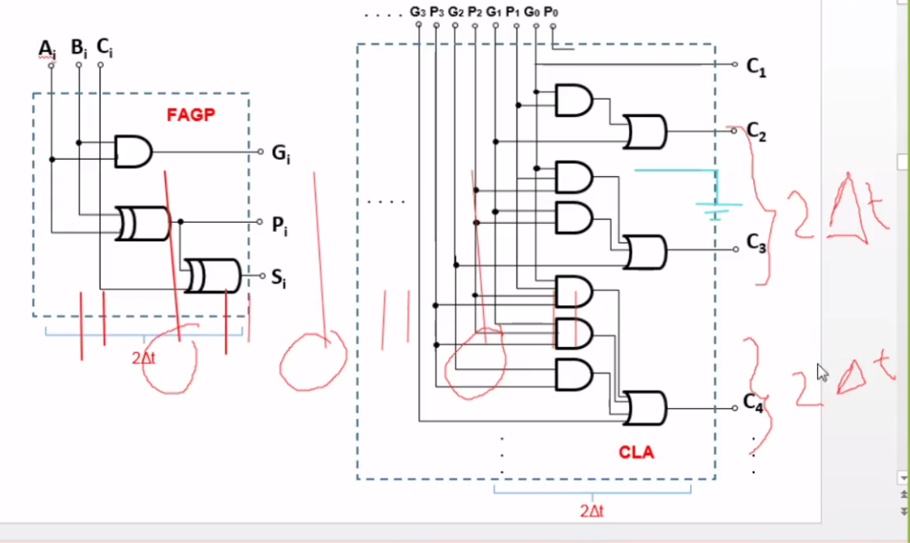

```
Título: Proyecto 3
Subtíulo: Diseñar un sumador de 2 palabras de 4 bits utilizando Carry Look Ahead
Alumno: Barrera Peña Víctor Miguel
```







# Requisitos

1. Diagrama de bloques
2. Número de entradas y salidas
3. Obtener las funciones booleanas
4. Implementación de compuertas lógicas
5. Simulación de cableado con chips.

Encontrar esto el pagina 384-385