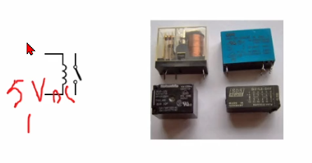
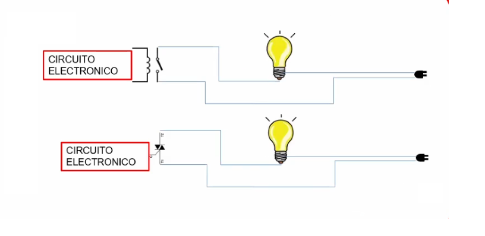
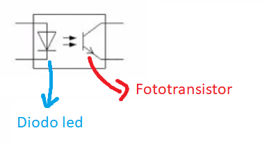
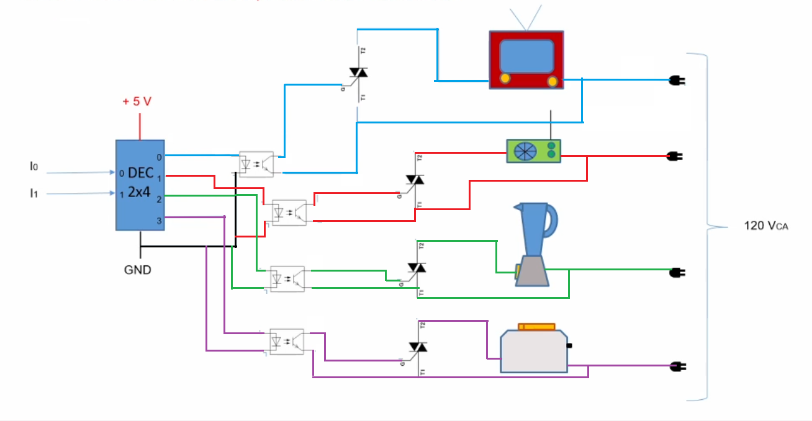

```json
{
    'nombre': 'Barrera Peña  Víctor Miguel',
    'tipo': 'Proyecto',
    'no': '4',
    'grupo':  '6',
    'materia': '1645 Diseño Digital Moderno',
    'semestre': '2022-1',
    'enunciado': 'Diseñar un selector de 4 dispositivos de  corriente alterna' ,
    'fecha': '01-12-2021'
}
```

<style>
    body{
  text-align: justify;
}
    h1{
        font-weight: bold;
        text-align:center;
    }
    p::first-letter{
  font-size: 1.3rem;
}
 a{
  text-decoration: none;
}
</style>
# Conocimiento previo

Triac


- G = Gate (5V)
- T1 =Corriente 1 (120V)
- T2= Corriente 2 (120V)

Deja pasar energía si el Gate esta abierto

## Relevadores



Atrae magnéticamente , los dos bracitos para que conduzca corriente

- Los dos bracitas conducen corriente alterna
- el que tiene semicírculos conduce corriente directa 5V

### Ejemplo de implementación



- Circuito electrónico conduce 5 [V]

# Esquema usando Triac


En la imagen se aprecia todos conectados a la corriente, lo único que les da la orden de prenderse o apagarse es el decodificador.

# Mejorando

Podemos mejorar la implementación usando

Optoacoplador



y es para no hacer directo

## Implementación con  Optoacopladores



## Piezas necesarias

- Optoacloplador
  - optoTrial Til111
- Triac
  - Triac (Tic 106)
- Decodificador 2x4
- 4x Focos

# Referencias

- Diapositivas DDM, Roberto Mandujano, Páginas 428-432, edición 2022-1.

