```json
{
    'nombre': 'Barrera Peña  Víctor Miguel',
    'tipo': 'Proyecto',
    'no': '4',
    'grupo':  '6',
    'materia': '1645 Diseño Digital Moderno',
    'semestre': '2022-1',
    'enunciado': 'Diseñar un selector de 4 dispositivos de  corriente alterna' ,
    'fecha': '01-12-2021'
}
```

<style>
    body{
  text-align: justify;
}
    h1{
        font-weight: bold;
        text-align:center;
    }
    p::first-letter{
  font-size: 1.3rem;
}
 a{
  text-decoration: none;
}
</style>
# Conocimiento previo

Triac

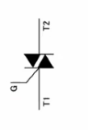

- G = Gate (5V)
- T1 =Corriente 1 (120V)
- T2= Corriente 2 (120V)

Deja pasar energía si el Gate esta abierto

## Relevadores


Atrae magnéticamente , los dos bracitos para que conduzca corriente

- Los dos bracitas conducen corriente alterna
- el que tiene semicírculos conduce corriente directa 5V

### Ejemplo de implementación


- Circuito electrónico conduce 5 [V]

# Esquema usando Triac

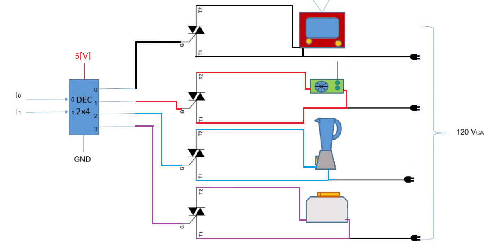

En la imagen se aprecia todos conectados a la corriente, lo único que les da la orden de prenderse o apagarse es el decodificador.

# Mejorando

Podemos mejorar la implementación usando

Optoacoplador


y es para no hacer directo

## Implementación con  Optoacopladores


## Piezas necesarias

#### Modo 1

opto acoplador y un triac

optriac y un triac

- Familia moc es upto triac
- El de la familia til es un optoacoplador
- Funcioa mejor con
- tic es un triac
- Moc + triac para la potencia

#### Modo 2

- Optoacloplador
  - optoTrial Til111  ( optriac 1 amprs)
- Triac
  - Triac (Tic 106)  (6 amprs)
- Decodificador 2x4
- 4x Focos

#### El del video

- Moc  (1 amper octo triac)
- Triacs

# Ejemplo un trabajo

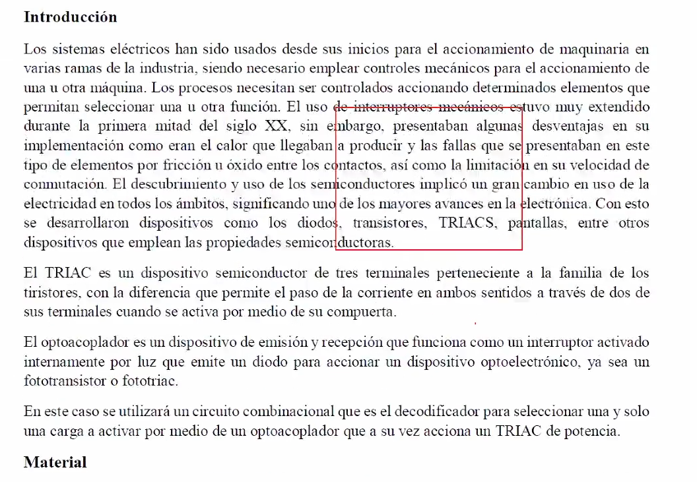

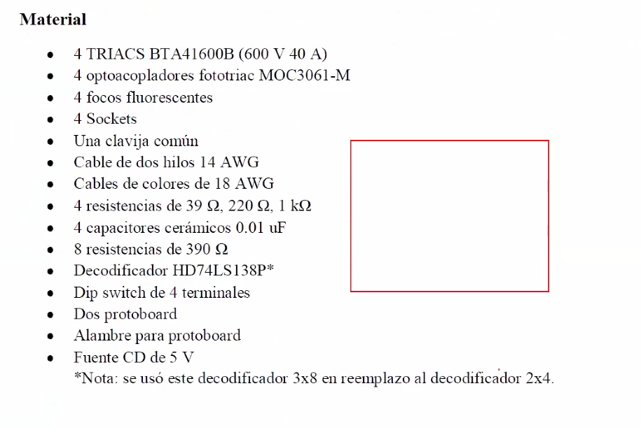

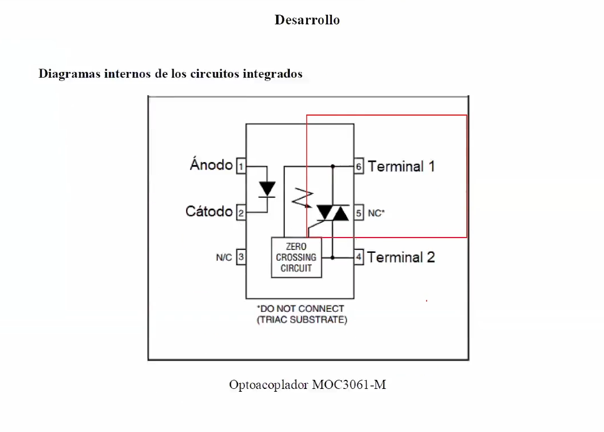

opto triac

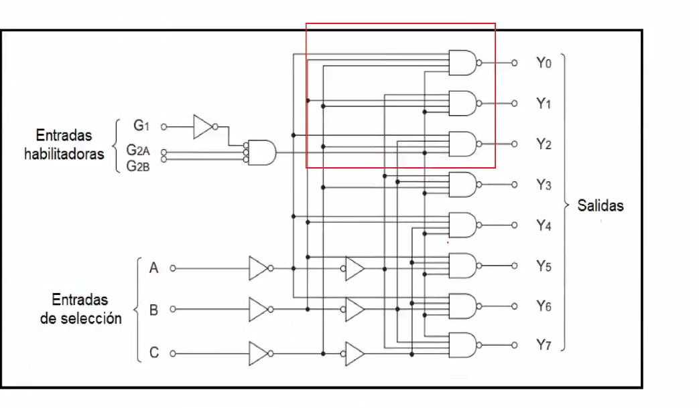

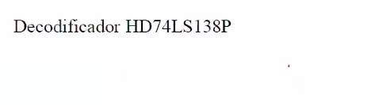

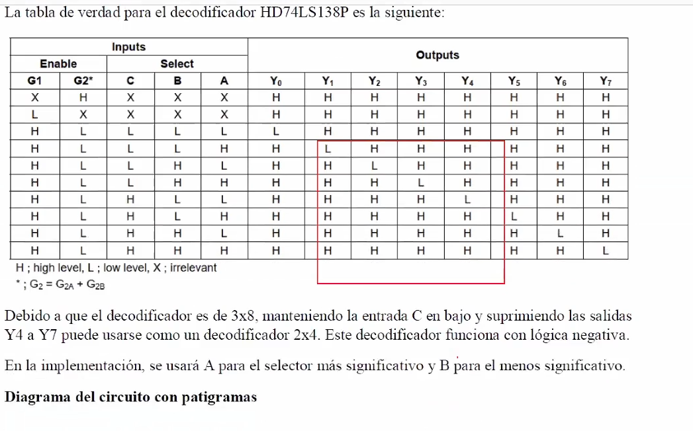

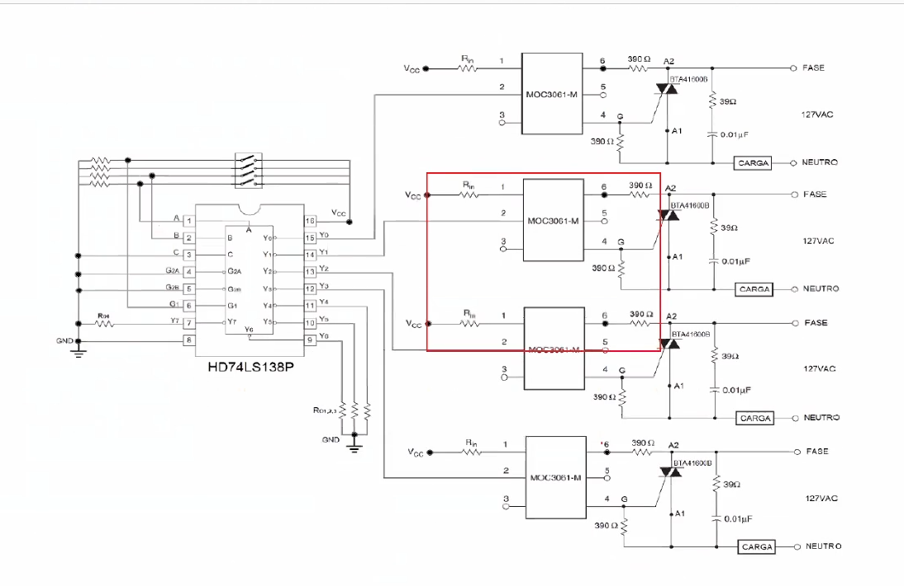

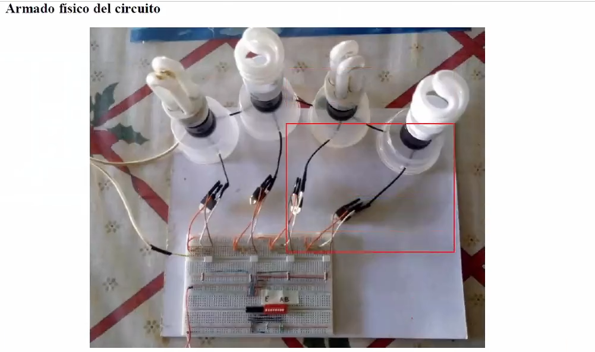

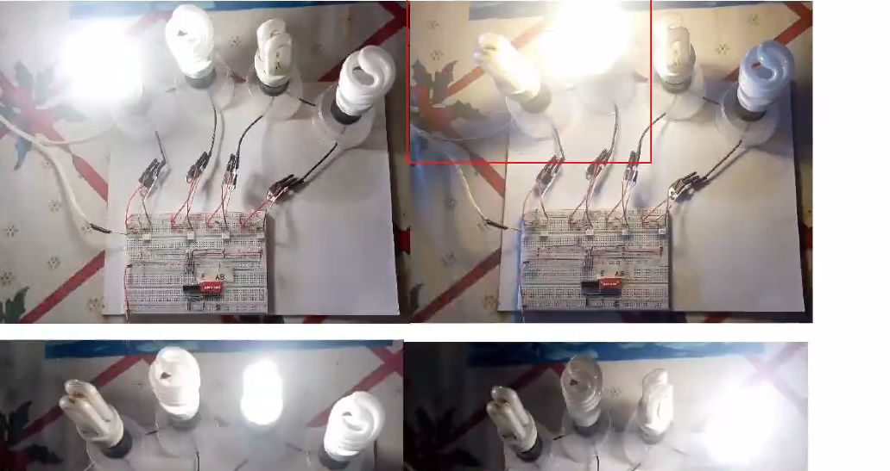

Conclusion y referencias

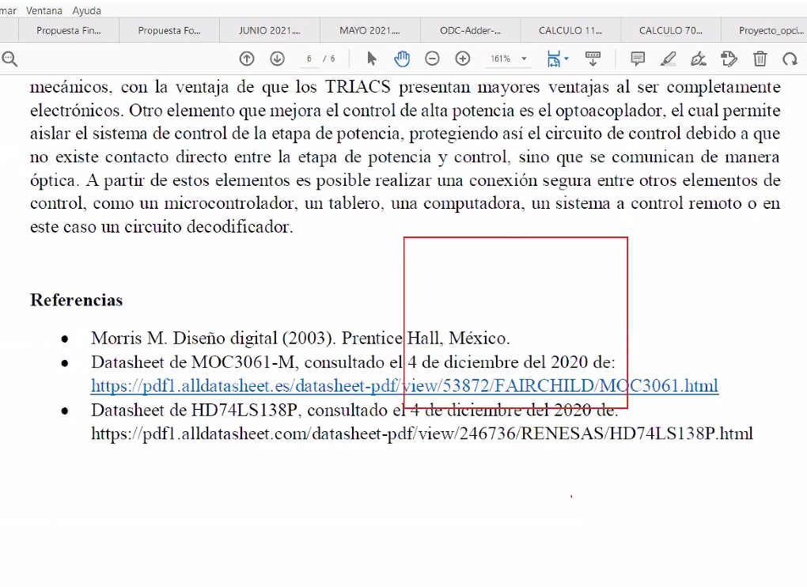

# Referencias

- Diapositivas DDM, Roberto Mandujano, Páginas 428-432, edición 2022-1.
- Ver más A9 2:41:00

 
