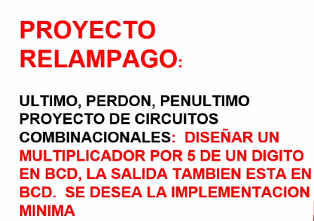

```json
{
    'nombre': 'Barrera Peña  Víctor Miguel',
    'tipo': 'Proyecto',
    'no': '5',
    'grupo':  '6',
    'materia': '1645 Diseño Digital Moderno',
    'semestre': '2022-1',
    'enunciado': 'Diseñar un multiplicador x5 de un dígito en BCD.Se desea implementación mínima' ,
    'fecha': '30-10-2021'
}
```

<style>
    body{
  text-align: justify;
}
    h1{
        font-weight: bold;
        text-align:center;
    }
    p::first-letter{
  font-size: 1.3rem;
}
 a{
  text-decoration: none;
}
</style>
# Problema



# Referencias

- Diapositivas DDM, Roberto Mandujano, Páginas 650, edición 2022-1.

  <!--Ver más A11-1 2:23:15-->

 
