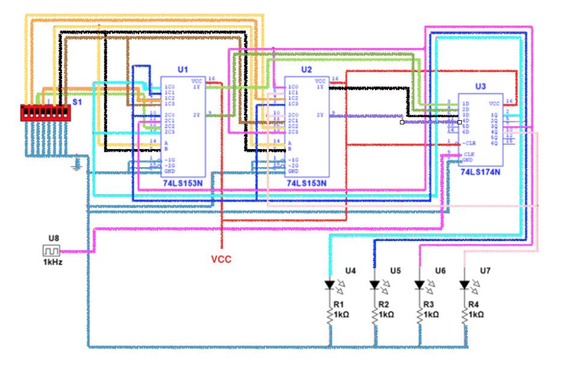

```json
{
    'nombre': 'Barrera Peña  Víctor Miguel',
    'tipo': 'Proyecto',
    'no': '9',
    'grupo':  '6',
    'materia': '1645 Diseño Digital Moderno',
    'semestre': '2022-1',
    'enunciado': 'Registro de corrimeinto' ,
    'fecha': '13-01-2021'
}
```

<style>
    body{
  text-align: justify;
}
    h1{
        font-weight: bold;
        text-align:center;
    }
    p::first-letter{
  font-size: 1.3rem;
}
 a{
  text-decoration: none;
}
</style>


# Objetivo

Implementar el funcionamiento de un registro mediante el uso de flip-flops.

# Introducción

Si conectamos varios flip-flops en serie o paralelos, podemos crear un flujo de datos entre ellos, digamos que cada flip-flop puede guardar la unidad básica de información el bit, si nosotros quisiéramos guardar un byte, entonces tendríamos que juntar 8, y conectarlos de tal manera que se pueda recuperar dicha información, e introducirle información, digamos que esto constituye  la herramienta básica precursora de un disto de estado solido.

# Materiales

● 1x reloj 555
● Cables para conexión
● 1x protoboard
● 1x Fuente de poder de 5V
● 2x multiplexores 74LS153
● 1x circuito integrado con flip flops 74LS174
● 1x dip switch de 7 entradas
● 4x leds
● 4x resistencias de 330 ohms
● 2x resistencias de 47k ohms
● 1x capacitar de 0.1 microfaradios
● 1x capacitor electrolítico de 30 microfaradios

#  Diagrama lógico



El diagrama es ilustrativo, para comprobarlo, tendría que recrearlo usando un software.

# Referencias

- Circuito, Circuito Integrado, Condensador El Ctrico, Circuito Digital, Giles Dalia, Guzm N Torres Elena, Recuperado de  https://www.coursehero.com/file/32552068/Registropdf/, el 13/01/2021

