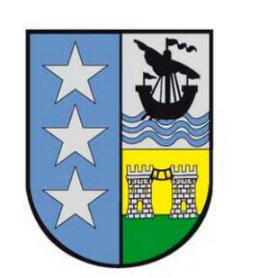

```json
{
    'nombre': 'Barrera Peña  Víctor Miguel',
    'tipo': 'Tarea',
    'no': '01',
    'grupo':  '6',
    'materia': '1645 Diseño Digital Moderno',
    'semestre': '2022-1',
    'enunciado': 'Origen de tú apellido y nombre',
    'fecha': '10-09-2021'
}
```


Mi nombre es  Víctor  << nombre para niños Víctor se deriva del verbo latino vincere que significa "superar", "el que vence" o "vencedor">> (*Nombre Víctor, origen y significado*, s. f.)

Miguel : <<Nombre masculino de origen hebreo que significa "¿Quién es como Dios?". Es el nombre del arcángel Miguel por lo que el nombre compuesto más común es Miguel Ángel>>(*Miguel - Origen y significado del nombre Miguel*, s. f.)

Barrera : <<El apellido procede de la voz “barrera”, común al castellano y catalán, con el significado de “barrizal” o “valla,”>>(de Zacatecas, 2021)



Peña:

- Origen: <<Es un apellido castellano muy antiguo. Las primeras referencias datan del año 750. Procede del valle de Mena (Burgos). Es un apellido muy extendido, uno de los 100 más frecuentes en España>>
- Significado:<<Viene del mismo sustantivo, que significa "roca de tamaño variable" o "cumbre de un monte". Es un toponímico muy frecuente en España>>(El Periódico de Aragón, s. f.)


# Referencias

- de Zacatecas, H. R. S. (2021, 2 marzo). *Heráldica del día; origen y significado del apellido Barrera*. El Sol de Zacatecas | Noticias Locales, Policiacas, sobre México, Zacatecas y el Mundo. https://www.elsoldezacatecas.com.mx/cultura/heraldica-del-dia-origen-y-significado-del-apellido-barrera-6426583.html
- El Periódico de Aragón. (s. f.). *Heráldica Aragonesa: Genealogía de AragÃ3n y Apellidos Aragoneses - RedAragon*. Recuperado 11 de septiembre de 2021, de http://redaragon.elperiodicodearagon.com/sociedad/heraldica/default.asp?heraldica_id=128&accion=pagina
- *Miguel - Origen y significado del nombre Miguel*. (s. f.). bekiapadres. Recuperado 11 de septiembre de 2021, de https://www.bekiapadres.com/nombres-bebe/miguel/
- *Nombre Víctor, origen y significado*. (s. f.). Conmishijos.com. Recuperado 11 de septiembre de 2021, de https://www.conmishijos.com/nombres/victor/
