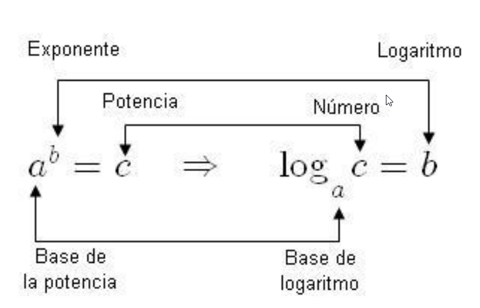

```json
{
    'nombre': 'Barrera Peña  Víctor Miguel',
    'tipo': 'Tarea',
    'no': '10',
    'grupo':  '6',
    'materia': '1645 Diseño Digital Moderno',
    'semestre': '2022-1',
    'enunciado': 'Realizar una  investigación: Partes de los logaritmos',
    'fecha': '14-09-2021'
}
```

<style>
    body{
  text-align: justify;
}
    h1{
        font-weight: bold;
        text-align:center;
    }
    p::first-letter{
  font-size: 1.3rem;
}
 a{
  text-decoration: none;
}
</style>
#  Partes de los logaritmos




# Referencias

*Logaritmos*. (s. f.). www.aiu.edu. Recuperado 13 de septiembre de 2021, de https://www.aiu.edu/cursos/matematica/pdf%20leccion%201/lecci%C3%B3n%201.3.pdf
