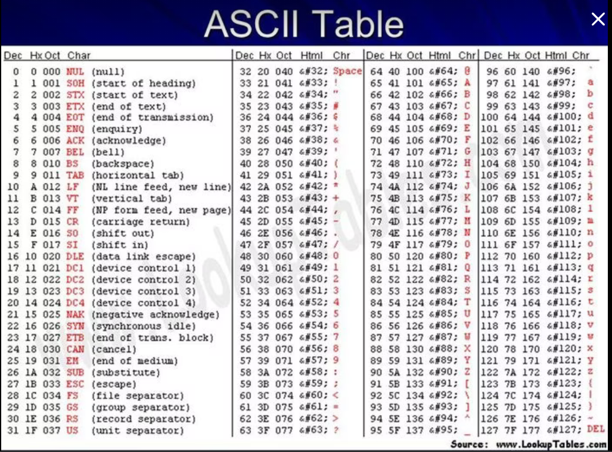

```json
{
    'nombre': 'Barrera Peña  Víctor Miguel',
    'tipo': 'Tarea',
    'no': '16',
    'grupo':  '6',
    'materia': '1645 Diseño Digital Moderno',
    'semestre': '2022-1',
    'enunciado': 'Realizar una  investigación sobre ASCII' ,
    'fecha': '24-09-2021'
}
```

<style>
    body{
  text-align: justify;
}
    h1{
        font-weight: bold;
        text-align:center;
    }
    p::first-letter{
  font-size: 1.3rem;
}
 a{
  text-decoration: none;
}
</style>
# Historia

El **código ASCII** es conocido como el acrónimo de las palabras inglesas **American Standard Code for Information Exchange** y en español significa **Código Estadounidense Estándar para el Intercambio de Información** >> [^re1].

<<El **ASCII en informática** se conoce como código fuente al texto desarrollado en un lenguaje de programación que debe ser compilado o desarrollado para poder ejecutar en un ordenador, que es una presentación de los caracteres alfanuméricos que es cuando está formado por letras y números y se hace fácil para la comunicación entre los diferentes dispositivos digitales>>[^re1].

# ASCII (original)

- 7 bits, 127 representaciones. Dentro de las representaciones tenemos a: caracteres de control (0-31,127), y caracteres imprimibles(todos los demás).

- El código ASCII también está incluido en Unicode, constituyendo los primeros 128 caracteres (o los 'más bajos').



# ASCII 8 bits (extendido)

Para vender máquinas en otros paises fué necesario incluir caracteres que no existían en el idioma inglés, por ello se implementó un bit más, para dar un resultado de 256 representaciones.


[^re1]:(ConceptoDefinicion, 2021)

# Referencias
1. Colaboradores de Wikipedia. (2021, 23 septiembre). ASCII. Wikipedia, la enciclopedia libre. https://es.wikipedia.org/wiki/ASCII
2. ConceptoDefinicion. (2021, 31 mayo). ASCII. Concepto de - Definición de. https://conceptodefinicion.de/ascii/
