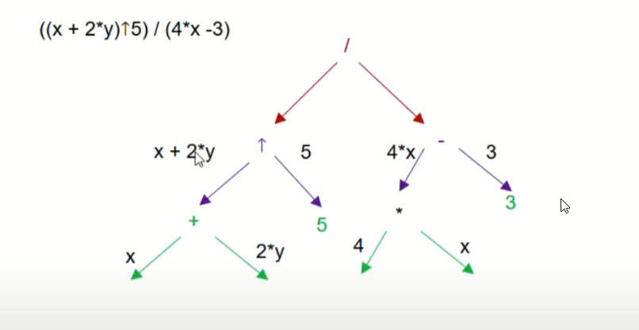
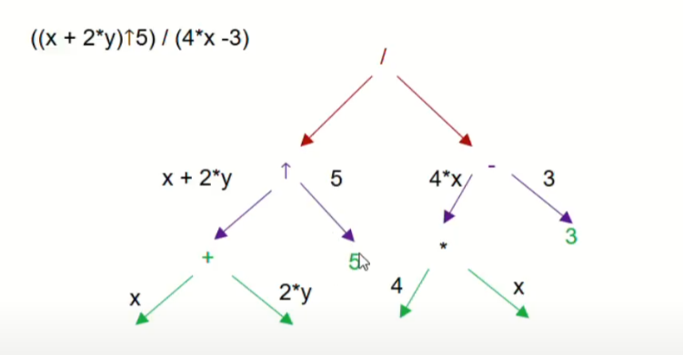
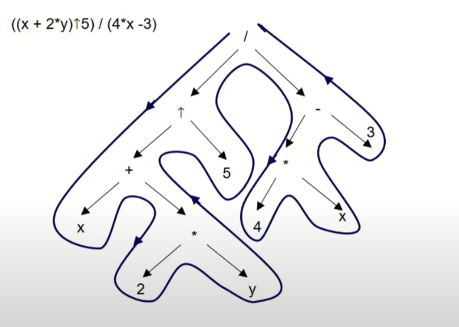
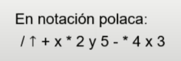
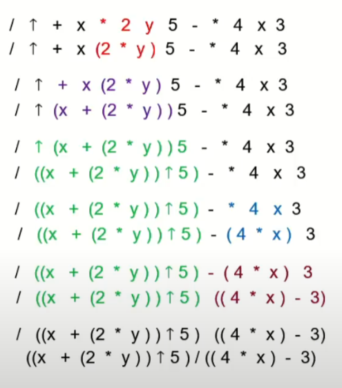

```json
{
    'nombre': 'Barrera Peña  Víctor Miguel',
    'tipo': 'Tarea',
    'no': '22',
    'grupo':  '6',
    'materia': '1645 Diseño Digital Moderno',
    'semestre': '2022-1',
    'enunciado': 'Realizar una  investigación: Notación polaca',
    'fecha': '23-09-21' 
}
```

<style>
    body{
  text-align: justify;
}
    h1{
        font-weight: bold;
        text-align:center;
    }
    p::first-letter{
  font-size: 1.3rem;
}
 a{
  text-decoration: none;
}
</style>
# Notación polaca

- También conocida como notación prefijo.
- Es una notación que te ayuda a omitir los paréntesis para escribir una operación, que de cierta manera la hace más rápida.
- Puedes reconocer fácilmente que una operación esta expresada de esta manera, ya que los operandos se encuentran a la derecha, mientras que los operadores se muestran a la izquierda, veamos el siguiente ejemplo :

> $*2 +56$ ==> 2* (5+6)

vemos la primera en prefija y la segunda en infija o mejor conocida como la común que utilizamos en nuestro día a día.

- Esta notación ayuda a las computadoras a procesar ciertas operaciones, ya que es más fácil de interpretar.

## Convertir a notación polaca

Primero tenemos que tener en cuenta que las operaciones son binarias (aritmética) y puede incluir algunas mondarias (lógica y conjuntos).

Se puede construir una árbol binario  de precedencia de operadores, donde de cada sub nodo interno es un operador, las hojas operandos, y las operaciones se ejecutan de izquierda a derecha.

> Ejemplo: ((x+2*y^2)/(4 * x-3))

Primero `^` es una potencia, por ejemplo `x^2` es $x^2$

> Paso 1: construimos el arbol



> Paso 2: Recorremos el árbol de manera recursiva, es decir el árbol tiene un sub-árbol izquierdo y uno derecho, además de la raiz (nodo padre). 

1. Recorre el árbol sub izquierdo, si este no es nodo hoja, repita este paso, pero aplicado al sub árbol izquierdo.
2. Si es nodo hoja, agréguelo a lista .
3. repite desde el paso 1, pero con el sub árbol derecho,
4. Si se recorrieron, el sub izquierdo y derecho, entonces agrega el padre, y sube un nivel hacia arriba.



> la manera fácil, usa una línea continua  y rodea el árbol en sentido antihorario, y de acuerdo a como recorra la línea, ve apuntado el nodo que se recorrió.



Anotado en la lista:




# De polaca a infija (normal)

De nada sirve una polaca, si no sabes como regresarla a su forma original.

El algoritmo es iterativo:

1. Recorre de izquierda a derecha con la mirada buscando el patrón ` T O O `. Donde O==operando  y T== es un operador. Esos tres elementos reordénalos de la siguiente manera `( O T O)` entre paréntesis, operando 1, operador, operando 2, paréntesis. 
2. Intercambia el `T O O` por el  `( O T O)` en la cadena original, vuelve a efectuar el procedimiento ,pero recuerda que `( O T O)` es equivalente a una simple `O`, ya que ahora es un operando.
3. Sigue ejecutando este algoritmo hasta que todo que expresado en notación infija.



vemos que quedó con las misma operación con la que empezamos.

Nota: Polaca inversa, es lo mismo pero invertir con un espejo de la siguiente:

> operacion || noicarepo

Donde la primera es polaca y la segunda es polca inversa.

# Referencias

- Universidad Politécnica de Valencia. (2018, 28 marzo). *S4.11 Notación polaca. | | UPV*. YouTube. https://www.youtube.com/watch?v=uFRRCWZUItI&t=250s


