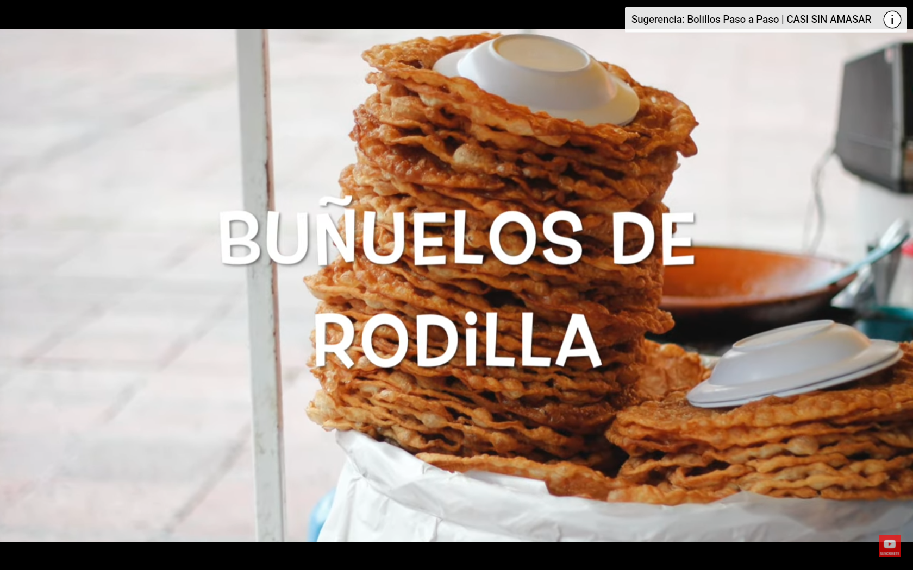
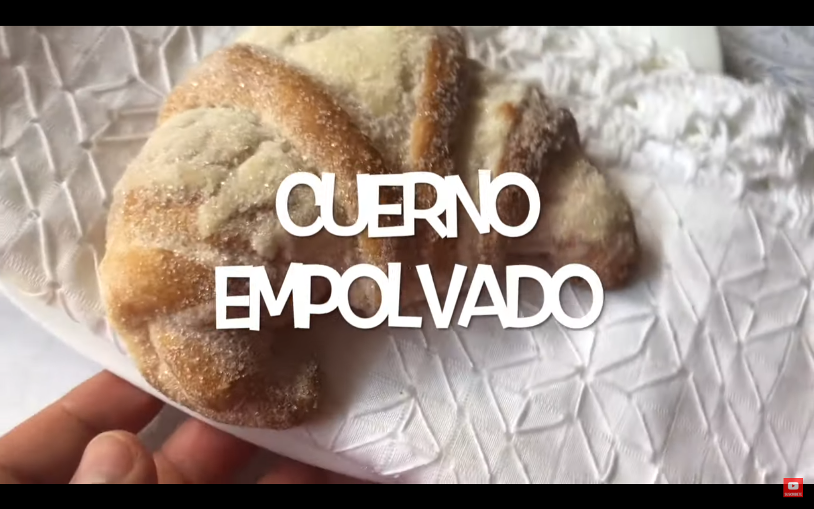
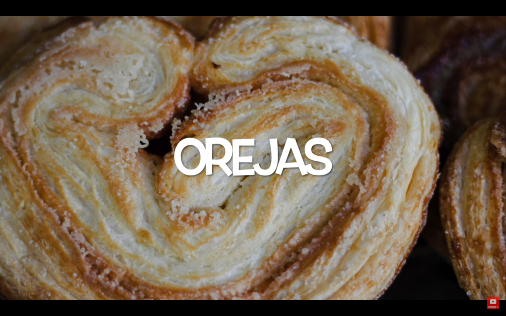
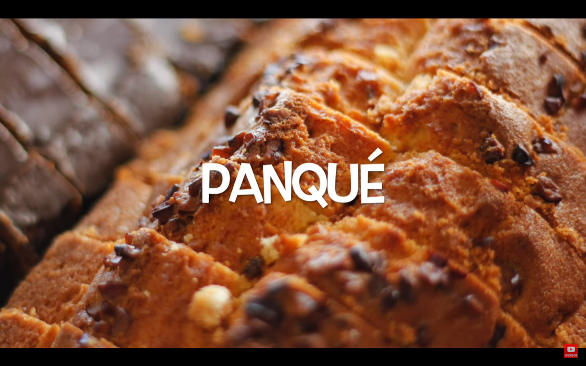

```json
{
    'nombre': 'Barrera Peña  Víctor Miguel' ,
    'tipo': 'Tarea',
    'no': '23',
    'grupo':  '6',
    'materia': '1645 Diseño Digital Moderno',
    'semestre': '2022-1',
    'enunciado': 'Investigar los bizcochos mexicanos',
    'fecha': '28-09-2021'
}
```

<style>
    body{
  text-align: justify;
}
    h1{
        font-weight: bold;
        text-align:center;
    }
    p::first-letter{
  font-size: 1.3rem;
}
 a{
  text-decoration: none;
}
    img{
       zoom:10%
    }
</style>


# Investigar los bizcochos mexicanos
Aquí encontre dos signifcados, por una parte se les dice bizcochos a los pantes, y tambíen hay un pan que se se llama bizcocho. Por ello pongo todas las imganes de panes mexicanos con su nombre  anexado.














# Referencias

- *Nombres de Pan Mexicano con Imágenes | Pan Dulce y Pan de Sal*. (2020, 21 julio). YouTube. https://www.youtube.com/watch?v=w7cKzbwfwys

