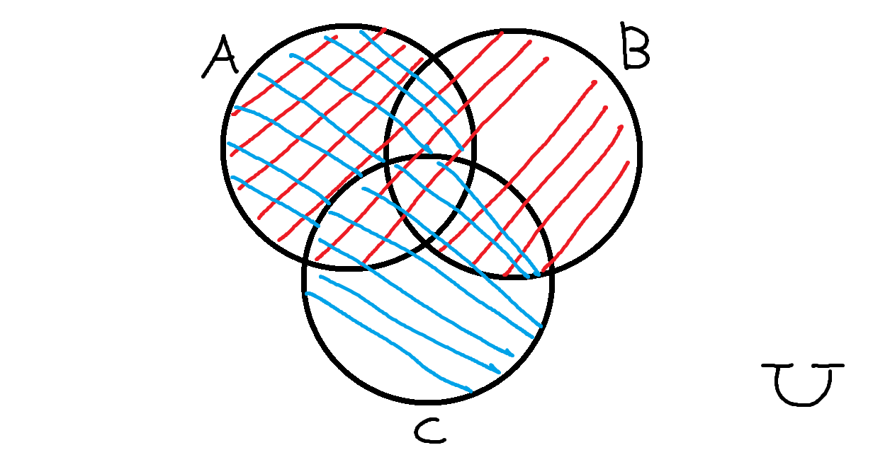

```json
{
    'nombre': 'Barrera Peña  Víctor Miguel',
    'tipo': 'Tarea',
    'no': '27',
    'grupo':  '6',
    'materia': '1645 Diseño Digital Moderno',
    'semestre': '2022-1',
    'enunciado': 'Demostrar los teoremas usando diagrams de Venn',
    'fecha': '28-09-21' 
}
```

<style>
    body{
  text-align: justify;
}
    h1{
        font-weight: bold;
        text-align:center;
    }
    p::first-letter{
  font-size: 1.3rem;
}
 a{
  text-decoration: none;
}
</style>
# Demostrar los teoremas usando diagramas de Venn

1) $a' + 0 =a \Rightarrow a \cup \emptyset =a$

2. $a \cdot 1 =a \longrightarrow A \cap U=A$


3. $a+1 =1 \longrightarrow A \cup U = U$


4. $a \cdot 0 =0 \longrightarrow A \cap \emptyset =\emptyset$


5. $ a+a =a \longrightarrow A \cup A=A$


6. $ a \cdot a =a \longrightarrow A \cap A=A$


7. $a + a' =1 \longrightarrow A \cup A' =U$


8. $(a)'=a'\longrightarrow (A)' = A$


9. $a \cdot a'=0\longrightarrow A \cap A'$


10. $ a(a+b) =a \longrightarrow A\cap (A \cup B)=A$


11. $a+ab=a\longrightarrow A \cap (A \cup B) =A$


12. $a (a' +b) = ab\longrightarrow A (A' \cup B) = A \cap B $


13. $a+a´b=a+b\longrightarrow A\cup (A' \cap B) = A+B$


14. $ab +ac = a(b+c)\longrightarrow A \cup(A' \cap B) =A+B$


15. $(a+b)(a+c)=a+bc\longrightarrow (A \cup B)\cap (A \cup C)$



16. $ab+ac + a'c=ab+c\longrightarrow (A \cap B) \cup (A \cap C) \cup (A' \cap C)=(A \cap B) \cup C$


17. $(a+b)(a'+c)=ac +a'b \longrightarrow (A \cup B) \cap (A' \cup C)= (A \cap C) \cup (A' \cap B)$


18. $ (a + b + c )' =a' \cdot b' \cdot c'\longrightarrow (A \cup B \cup C )' =A' \cap B' \cap C' $


19. $ (a \cdot b \cdot c )' =a'+b' +c'\longrightarrow (A \cap B \cap C )' =A' \cup B' \cup C' $


20. $(a')'\longrightarrow (A')'$


