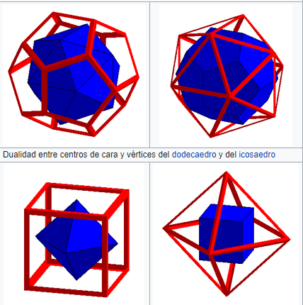

```json
{
    'nombre': 'Barrera Peña  Víctor Miguel',
    'tipo': 'Tarea',
    'no': '28',
    'grupo':  '6',
    'materia': '1645 Diseño Digital Moderno',
    'semestre': '2022-1',
    'enunciado': 'Realizar una  investigación Teoremas duales ',
    'fecha': '01-10-2021'
}
```

<style>
    body{
  text-align: justify;
}
    h1{
        font-weight: bold;
        text-align:center;
    }
    p::first-letter{
  font-size: 1.3rem;
}
 a{
  text-decoration: none;
}
</style>


# Teoremas duales

En matemáticas, una dualidad, en términos generales, traduce conceptos, teoremas o estructuras matemáticas en otros conceptos, teoremas o estructuras, mediante una correspondencia uno a uno, a menudo (pero no siempre) por medio de una operación de involución: si el dual de A es B, entonces el dual de B es A. Tales involuciones a veces tienen puntos fijos, de modo que el dual de A es A en sí mismo. Por ejemplo, el teorema de Desargues expresa una condición auto dual en este sentido bajo el concepto de dualidad en geometría proyectiva.

En contextos matemáticos, el término dualidad tiene numerosos significados,1 aunque es «un concepto muy dominante e importante en matemáticas (modernas)»2 y «un tema general de gran interés que tiene manifestaciones en casi todas las áreas de las matemáticas»



En boole significa lo siguiente:

 A partir de las propiedades anteriores se pueden deducir una serie de **postulados**, muy importantes a la hora de poder simplificar **funciones booleanas**. Aunque no se demuestre existe un principio básico, llamado **Principio de Dualidad**, que afirma que siempre que se cumpla una ley o teorema en el álgebra de Boole, también es válido en su forma dual. La **forma dual** de una expresión booleana dada es la que se consigue al cambiar las sumas por productos y los productos por sumas, respectivamente. Por ejemplo: **A+B·C** y **A·(B+C)** son **expresiones duales**.

El dual de una expresión booleana se obtiene intercambiando entre si la suma y el producto booleanos, así como los ceros y los unos. En la tabla de las propiedades anteriores, se observa dicha dualidad en las filas 2 a la 8. Ejemplos: 𝑥(𝑦 + 0) es dual de 𝑥 + (𝑦. 1) 𝑥. 1 + (𝑦 + 𝑧) es dual de (𝑥 + 0). (𝑦. 𝑧) Principio de dualidad: El dual de una función booleana F representada por una expresión booleana, es la función representada por el dual de la expresión.

# Referencias

colaboradores de Wikipedia. (2021, 30 mayo). *Dualidad (matemáticas)*. Wikipedia, la enciclopedia libre. Recuperado 28 de septiembre de 2021, de https://es.wikipedia.org/wiki/Dualidad_(matem%C3%A1ticas)

P.R.A. (s. f.). *Práctico 5 - Álgebra de Boole*. https://www.fing.edu.uy/. Recuperado 28 de septiembre de 2021, de https://www.fing.edu.uy/tecnoinf/maldonado/cursos/mdl1/material/2017/practico5.pdf
