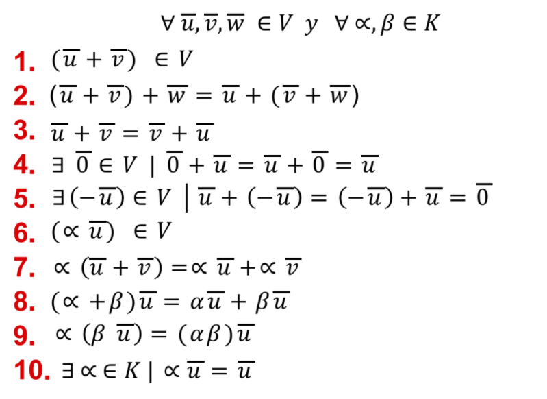

```json
{
    'nombre': 'Barrera Peña  Víctor Miguel' ,
   'tipo': 'Tarea',
    'no': '29',
    'grupo':  '6',
    'materia': '1645 Diseño Digital Moderno',
    'semestre': '2022-1',
    'enunciado': '¿Qué forma el Álgebra de boole?',
    'fecha': '01-10-2021'
}
```


# ¿Qué forma el Álgebra de boole?



Podemos ver que la anterior definción de un espacio vectorial,podemos adaptar ello tenemos que hacer ciertos ajustes 

$\forall U,V \in \left[0,1\right]^*;\forall \alpha,\beta \in K$

Si tiene duda de como se mapea $ 100b \Rightarrow 1x^2+1x^1+0x^0$ vemos que ahora tiene la forma de un campo vectorial, ya que los polinomios lo tiene que adaptar la forma, y esa es una demostración por simil de forma.

Por tanto digo que para la suma y multiplicación en álgebra de boole tiene estructura de campo vectorial

