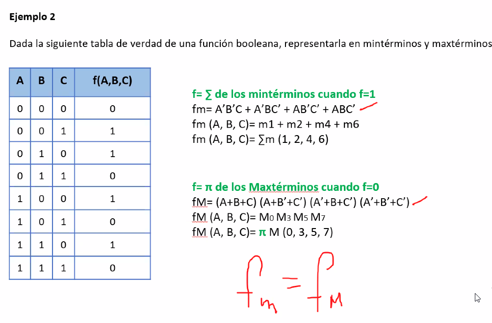
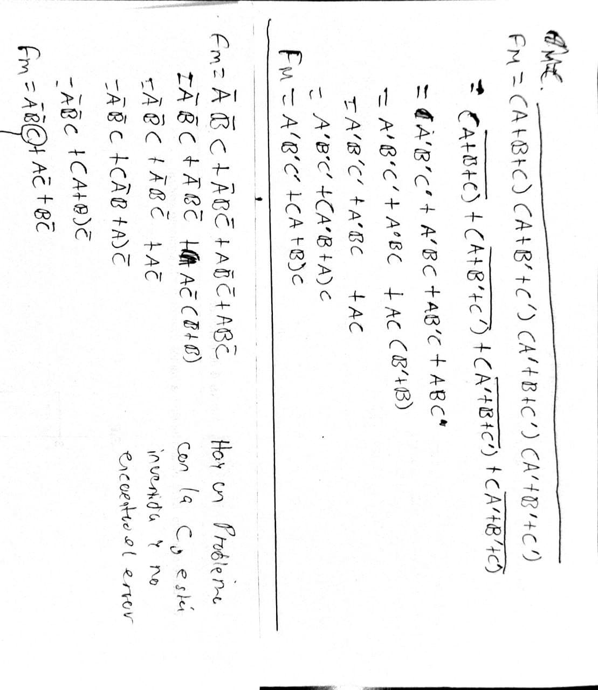

```json
{
    'nombre': 'Barrera Peña  Víctor Miguel' ,
    'tipo': 'Tarea',
    'no': '31',
    'grupo':  '6',
    'materia': '1645 Diseño Digital Moderno',
    'semestre': '2022-1',
    'enunciado': 'Demostrar como pasar de mini terminos a max terminos',
    'fecha': '08-10-2021'
}
```


# Problema



# Solución



hay un problema con $C$ es su opuesto entre max y miniterminos y no encontré el error.

Para hacer la igualdad se establece $f_m=\overline{f_M}$
