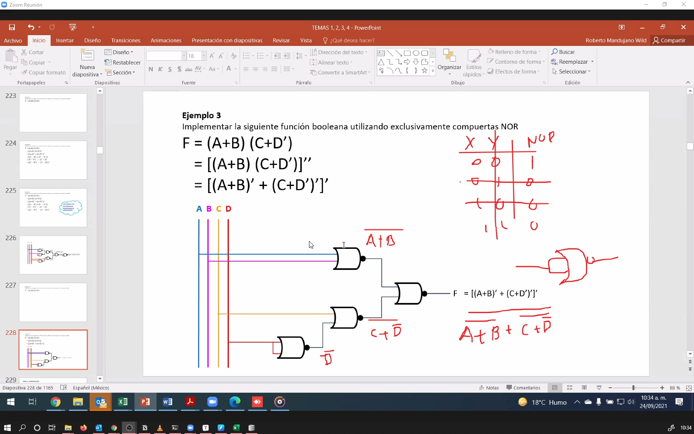
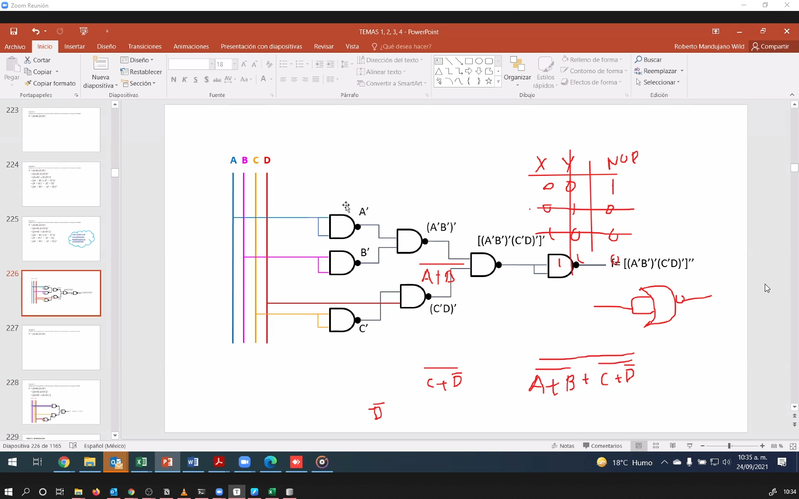

```json
{
    'nombre': 'Barrera Peña  Víctor Miguel' ,
    'tipo': 'Tarea',
    'no': '34',
    'grupo':  '6',
    'materia': '1645 Diseño Digital Moderno',
    'semestre': '2022-1',
    'enunciado': 'Pasar de una inplementacion de nand a nord, el caso general',
    'fecha': '08-10-2021'
}
```

# Problema

Tenemos que pasar de nor a nand o viceversa

Primero veamos la nor




Ahora veamos la puerta nand



La deducción es simple aplicamos de morgan desde afuera hasta que se propague a las variables iniciales
$$
\begin{aligned}
	&\left [(A+B)'+(C+D')' \right]' , \text{con compuetas NOR ,aplicamos de Morgan} \\
	&(\overline{A+B})' \cdot(\overline{C+D'})' , \text{aplicamos de Morgan} \\
	&(A' \cdot B')' \cdot(C'  D')'  , \text{Esta es la función con compuertas NAND} \\
	
\end{aligned}
$$
Vemos que lo único que tenemos que hacer para pasar de NOR => NAND es aplicar de Morgan hasta que esa propagación llegue a las variables, para hacerlo de NAND => NOR es aplicar de Morgan pero al revés, es decir  que las variables se nieguen ,el operador se intercambie y los dos operandos + el operador se nieguen todo entre parentesís, se termina el proceso hasta que la negación llegue al paréntesis más externo.
