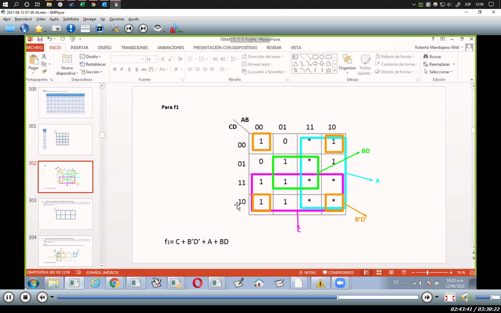
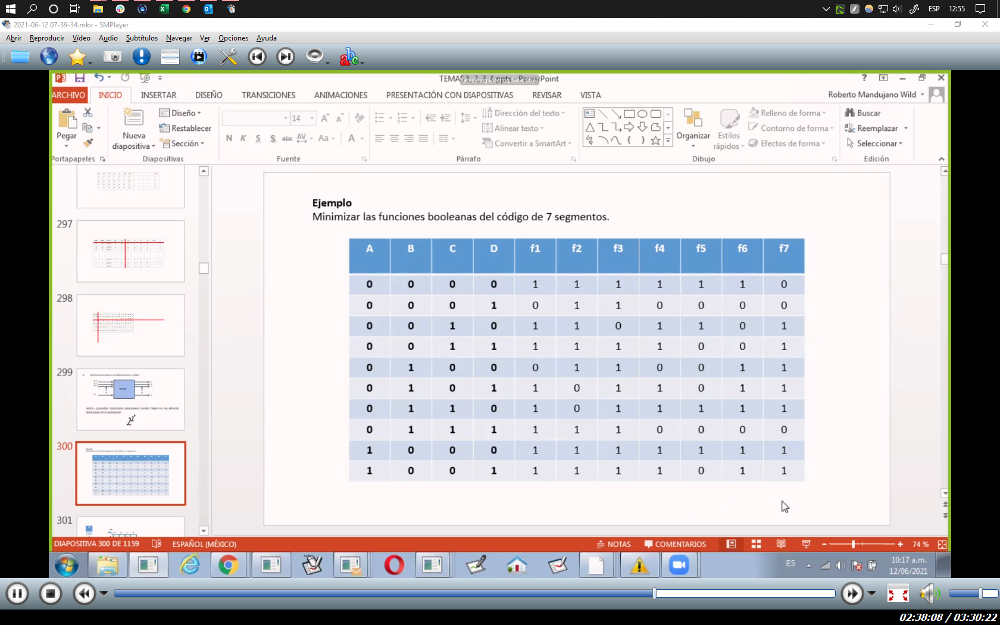
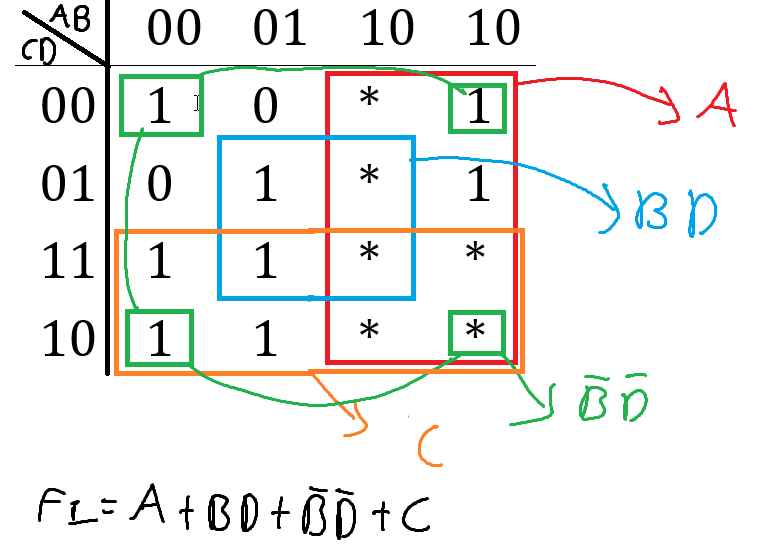
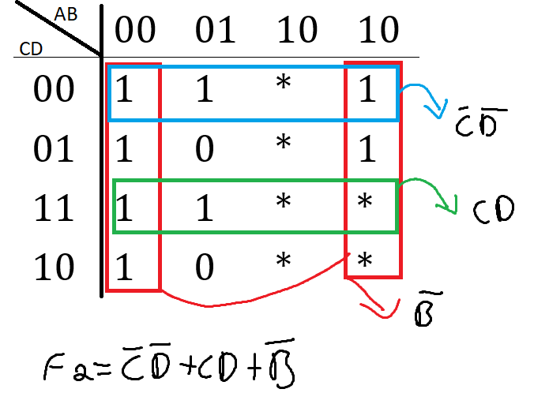
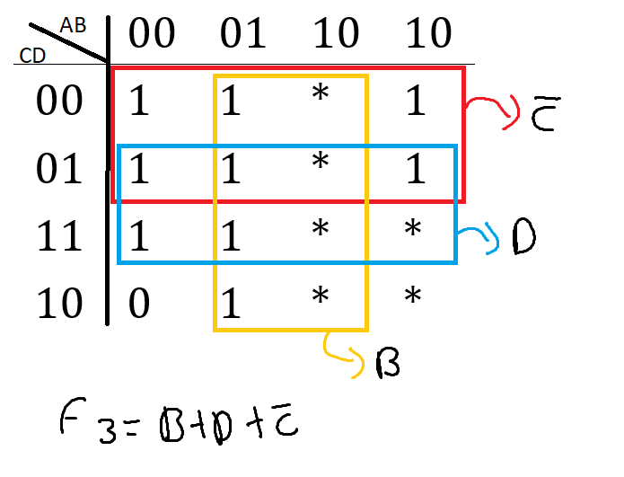
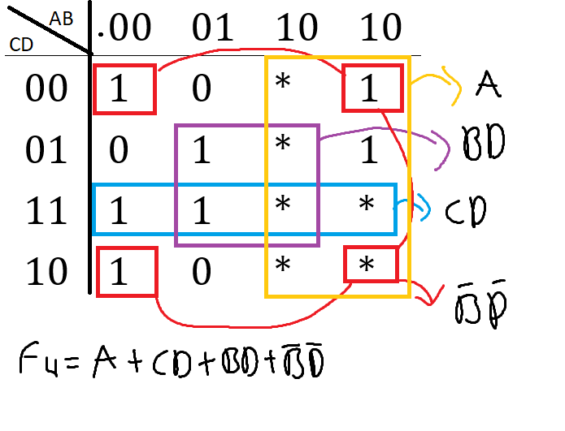
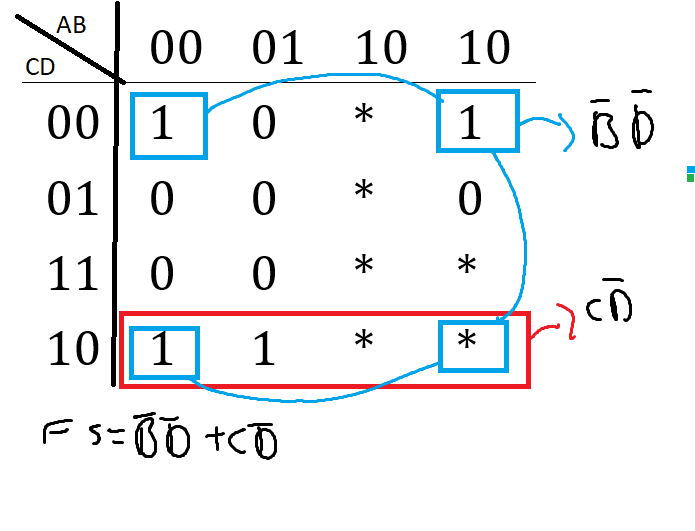
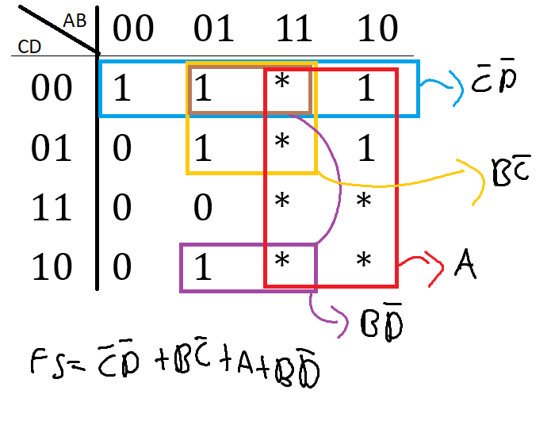
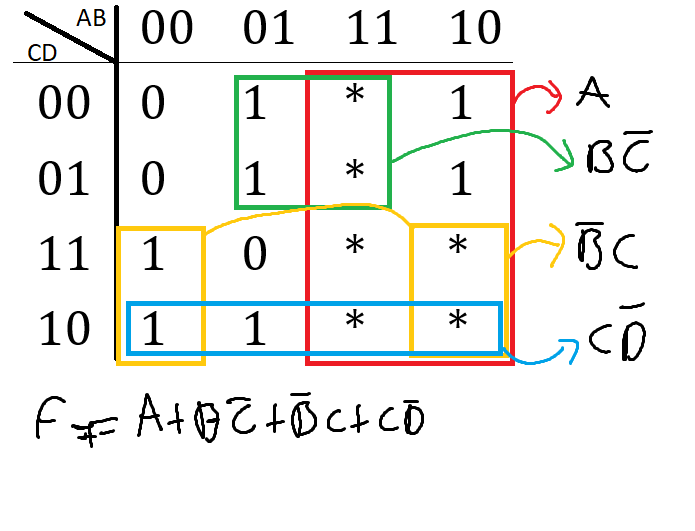

```json
{
    'nombre': 'Barrera Peña  Víctor Miguel',
    'tipo': 'Tarea',
    'no': '35',
    'grupo':  '6',
    'materia': '1645 Diseño Digital Moderno',
    'semestre': '2022-1',
    'enunciado': 'Minimizar la función de 7 segmentos ',
    'fecha': '15-10-2021'
}
```

<style>
    body{
  text-align: justify;
}
    h1{
        font-weight: bold;
        text-align:center;
    }
    p::first-letter{
  font-size: 1.3rem;
}
 a{
  text-decoration: none;
}
</style>
# Minimizar la función de 7 segmentos





| A    | B    | C    | D    | f1   | f2   | f3   | f4   | f5   | f6   | f7   |
| ---- | ---- | ---- | ---- | ---- | ---- | ---- | ---- | ---- | ---- | ---- |
| 0    | 0    | 0    | 1    | 1    | 1    | 1    | 1    | 1    | 1    | 0    |
| 0    | 0    | 0    | 1    | 0    | 1    | 1    | 0    | 0    | 0    | 0    |
| 0    | 0    | 1    | 0    | 1    | 1    | 0    | 1    | 1    | 0    | 1    |
| 0    | 0    | 1    | 1    | 1    | 1    | 1    | 1    | 0    | 0    | 1    |
| 0    | 1    | 0    | 0    | 0    | 1    | 1    | 0    | 0    | 1    | 1    |
| 0    | 1    | 0    | 1    | 1    | 0    | 1    | 1    | 0    | 1    | 1    |
| 0    | 1    | 1    | 0    | 1    | 0    | 1    | 1    | 1    | 1    | 1    |
| 0    | 1    | 1    | 1    | 1    | 1    | 1    | 0    | 0    | 0    | 0    |
| 1    | 0    | 0    | 0    | 1    | 1    | 1    | 1    | 1    | 1    | 1    |
| 1    | 0    | 0    | 1    | 1    | 1    | 1    | 1    | 0    | 1    | 1    |


La tabla donde dibujar

f1

|      | 00   | 01   | 11   | 10   |
| ---- | ---- | ---- | ---- | ---- |
| 00   | 1    | 0    | *    | 1    |
| 01   | 0    | 1    | *    | 1    |
| 11   | 1    | 1    | *    | *    |
| 10   | 1    | 1    | *    | *    |

f2
|      | 00   | 01   | 11   | 10   |
| ---- | ---- | ---- | ---- | ---- |
| 00   | 1    | 1    | *    | 1    |
| 01   | 1    | 0    | *    | 1    |
| 11   | 1    | 1    | *    | *    |
| 10   | 1    | 0    | *    | *    |

f3
|      | 00   | 01   | 11   | 10   |
| ---- | ---- | ---- | ---- | ---- |
| 00   | 1    | 1    | *    | 1    |
| 01   | 1    | 1    | *    | 1    |
| 11   | 1    | 1    | *    | *    |
| 10   | 0    | 1    | *    | *    |

f4
|      | 00   | 01   | 11   | 10   |
| ---- | ---- | ---- | ---- | ---- |
| 00   | 1    | 0    | *    | 1    |
| 01   | 0    | 1    | *    | 1    |
| 11   | 1    | 1    | *    | *    |
| 10   | 1    | 0    | *    | *    |

f5
|      | 00   | 01   | 11   | 10   |
| ---- | ---- | ---- | ---- | ---- |
| 00   | 1    | 0    | *    | 1    |
| 01   | 0    | 0    | *    | 0    |
| 11   | 0    | 0    | *    | *    |
| 10   | 1    | 1    | *    | *    |

f6
|      | 00   | 01   | 11   | 10   |
| ---- | ---- | ---- | ---- | ---- |
| 00   | 1    | 1    | *    | 1    |
| 01   | 0    | 1    | *    | 1    |
| 11   | 0    | 0    | *    | *    |
| 10   | 0    | 1    | *    | *    |

f7
|      | 00   | 01   | 11   | 10   |
| ---- | ---- | ---- | ---- | ---- |
| 00   | 0    | 1    | *    | 1    |
| 01   | 0    | 1    | *    | 1    |
| 11   | 1    | 0    | *    | *    |
| 10   | 1    | 1    | *    | *    |


## Minimizando las funciones

f1



f2



f3



f4



f5



f6



f7


