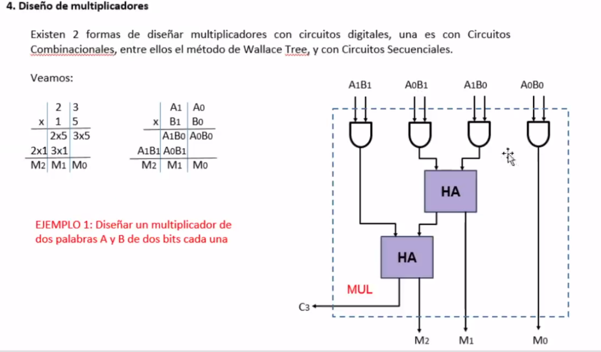
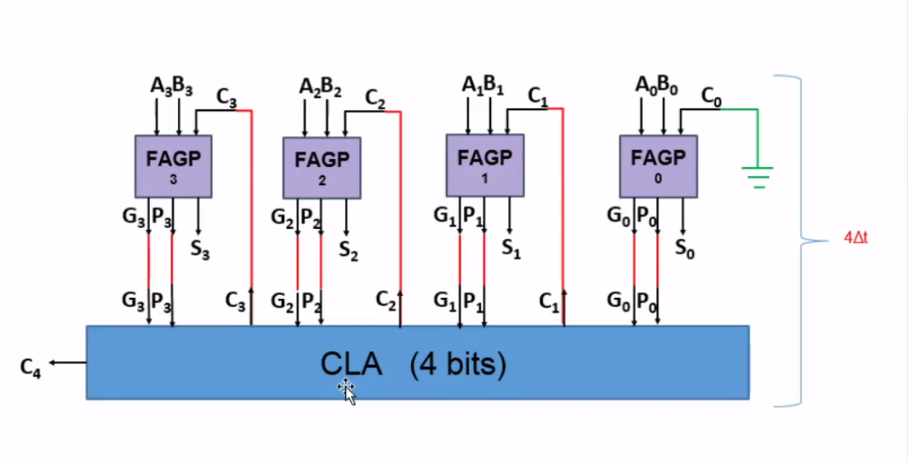
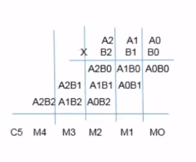
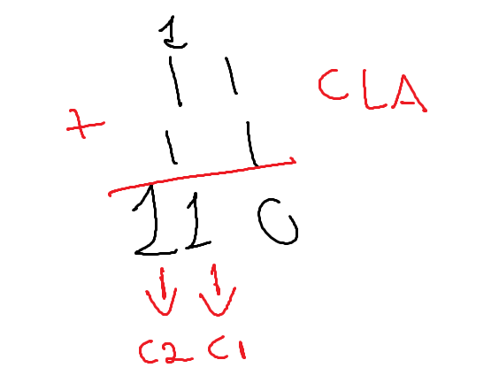
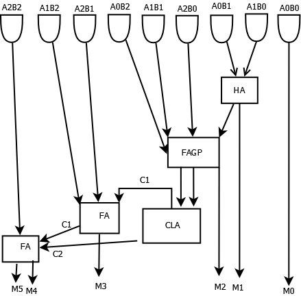

```json
{
    'nombre': 'Barrera Peña  Víctor Miguel',
    'tipo': 'Tarea',
    'no': '40',
    'grupo':  '6',
    'materia': '1645 Diseño Digital Moderno',
    'semestre': '2022-1',
    'enunciado': 'Diseñar un multiplicador de 2 palabras A y B de tres bits cada una',
    'fecha': '15-09-2021'
}
```

<style>
    body{
  text-align: justify;
}
    h1{
        font-weight: bold;
        text-align:center;
    }
    p::first-letter{
  font-size: 1.3rem;
}
 a{
  text-decoration: none;
}
</style>
# Ejemplo



Recuerda esto



# Multiplicador 2 palabras

implementar esta



DEFINIMOS UN NUEVO CLA



## Solución


