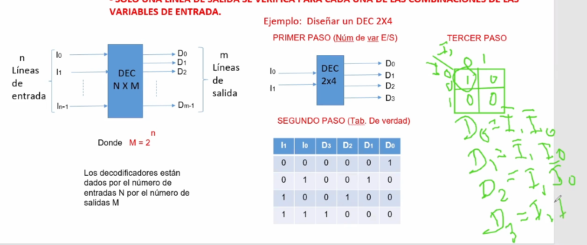
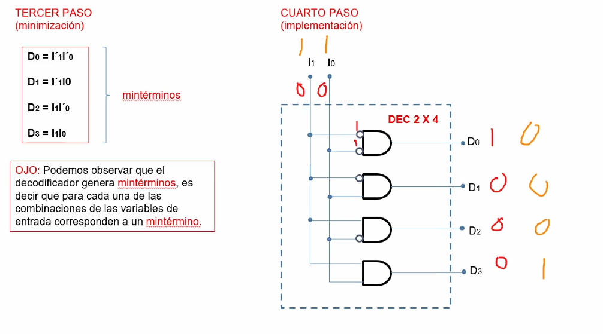
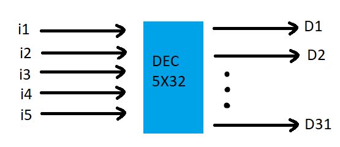
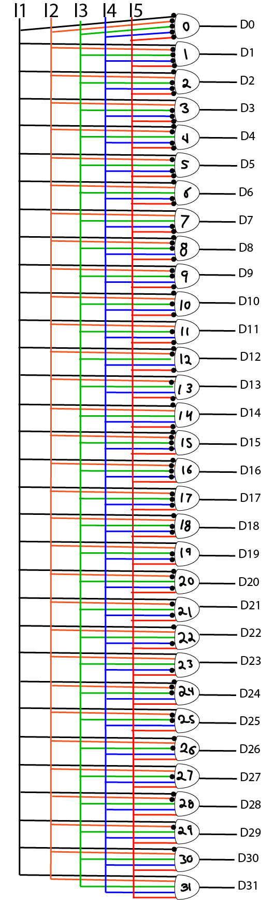

```json
{
    'nombre': 'Barrera Peña  Víctor Miguel',
    'tipo': 'Tarea',
    'no': '42',
    'grupo':  '6',
    'materia': '1645 Diseño Digital Moderno',
    'semestre': '2022-1',
    'enunciado': 'Decodificador  5x32' ,
    'fecha': '15-10-2021'
}
```

<style>
    body{
  text-align: justify;
}
    h1{
        font-weight: bold;
        text-align:center;
    }
    p::first-letter{
  font-size: 1.3rem;
}
 a{
  text-decoration: none;
}
</style>


# Ejemplo





# Dec 5x32

## Paso 1

Número variables entrada y salida



## Paso 2

Tabla de verdad

las casillas vacías equivalen a que dentro hay 0.

| I1   | I2   | I3   | I4   | I5   | D9   | D8   | D7   | D6   | D5   | D4   | D3   | D2   | D1   | D0   |
| ---- | ---- | ---- | ---- | ---- | ---- | ---- | ---- | ---- | ---- | ---- | ---- | ---- | ---- | ---- |
| 0    | 0    | 0    | 0    | 0    |      |      |      |      |      |      |      |      |      | 1    |
| 0    | 0    | 0    | 0    | 1    |      |      |      |      |      |      |      |      | 1    |      |
| 0    | 0    | 0    | 1    | 0    |      |      |      |      |      |      |      | 1    |      |      |
| 0    | 0    | 0    | 1    | 1    |      |      |      |      |      |      | 1    |      |      |      |
| 0    | 0    | 1    | 0    | 0    |      |      |      |      |      | 1    |      |      |      |      |
| 0    | 0    | 1    | 0    | 1    |      |      |      |      | 1    |      |      |      |      |      |
| 0    | 0    | 1    | 1    | 0    |      |      |      | 1    |      |      |      |      |      |      |
| 0    | 0    | 1    | 1    | 1    |      |      | 1    |      |      |      |      |      |      |      |
| 0    | 1    | 0    | 0    | 0    |      | 1    |      |      |      |      |      |      |      |      |
| 0    | 1    | 0    | 0    | 1    | 1    |      |      |      |      |      |      |      |      |      |
| 0    | 1    | 0    | 1    | 0    |      |      |      |      |      |      |      |      |      |      |
| 0    | 1    | 0    | 1    | 1    |      |      |      |      |      |      |      |      |      |      |
| 0    | 1    | 1    | 0    | 0    |      |      |      |      |      |      |      |      |      |      |
| 0    | 1    | 1    | 0    | 1    |      |      |      |      |      |      |      |      |      |      |
| 0    | 1    | 1    | 1    | 0    |      |      |      |      |      |      |      |      |      |      |
| 0    | 1    | 1    | 1    | 1    |      |      |      |      |      |      |      |      |      |      |
| 1    | 0    | 0    | 0    | 0    |      |      |      |      |      |      |      |      |      |      |
| 1    | 0    | 0    | 0    | 1    |      |      |      |      |      |      |      |      |      |      |
| 1    | 0    | 0    | 1    | 0    |      |      |      |      |      |      |      |      |      |      |
| 1    | 0    | 0    | 1    | 1    |      |      |      |      |      |      |      |      |      |      |
| 1    | 0    | 1    | 0    | 0    |      |      |      |      |      |      |      |      |      |      |
| 1    | 0    | 1    | 0    | 1    |      |      |      |      |      |      |      |      |      |      |
| 1    | 0    | 1    | 1    | 0    |      |      |      |      |      |      |      |      |      |      |
| 1    | 0    | 1    | 1    | 1    |      |      |      |      |      |      |      |      |      |      |
| 1    | 1    | 0    | 0    | 0    |      |      |      |      |      |      |      |      |      |      |
| 1    | 1    | 0    | 0    | 1    |      |      |      |      |      |      |      |      |      |      |
| 1    | 1    | 0    | 1    | 0    |      |      |      |      |      |      |      |      |      |      |
| 1    | 1    | 0    | 1    | 1    |      |      |      |      |      |      |      |      |      |      |
| 1    | 1    | 1    | 0    | 0    |      |      |      |      |      |      |      |      |      |      |
| 1    | 1    | 1    | 0    | 1    |      |      |      |      |      |      |      |      |      |      |
| 1    | 1    | 1    | 1    | 0    |      |      |      |      |      |      |      |      |      |      |
| 1    | 1    | 1    | 1    | 1    |      |      |      |      |      |      |      |      |      |      |


| I1   | I2   | I3   | I4   | I5   | D19  | D18  | D17  | D16  | D15  | D14  | D13  | D12  | D11  | D10  |
| ---- | ---- | ---- | ---- | ---- | ---- | ---- | ---- | ---- | ---- | ---- | ---- | ---- | ---- | ---- |
| 0    | 0    | 0    | 0    | 0    |      |      |      |      |      |      |      |      |      |      |
| 0    | 0    | 0    | 0    | 1    |      |      |      |      |      |      |      |      |      |      |
| 0    | 0    | 0    | 1    | 0    |      |      |      |      |      |      |      |      |      |      |
| 0    | 0    | 0    | 1    | 1    |      |      |      |      |      |      |      |      |      |      |
| 0    | 0    | 1    | 0    | 0    |      |      |      |      |      |      |      |      |      |      |
| 0    | 0    | 1    | 0    | 1    |      |      |      |      |      |      |      |      |      |      |
| 0    | 0    | 1    | 1    | 0    |      |      |      |      |      |      |      |      |      |      |
| 0    | 0    | 1    | 1    | 1    |      |      |      |      |      |      |      |      |      |      |
| 0    | 1    | 0    | 0    | 0    |      |      |      |      |      |      |      |      |      |      |
| 0    | 1    | 0    | 0    | 1    |      |      |      |      |      |      |      |      |      |      |
| 0    | 1    | 0    | 1    | 0    |      |      |      |      |      |      |      |      |      | 1    |
| 0    | 1    | 0    | 1    | 1    |      |      |      |      |      |      |      |      | 1    |      |
| 0    | 1    | 1    | 0    | 0    |      |      |      |      |      |      |      | 1    |      |      |
| 0    | 1    | 1    | 0    | 1    |      |      |      |      |      |      | 1    |      |      |      |
| 0    | 1    | 1    | 1    | 0    |      |      |      |      |      | 1    |      |      |      |      |
| 0    | 1    | 1    | 1    | 1    |      |      |      |      | 1    |      |      |      |      |      |
| 1    | 0    | 0    | 0    | 0    |      |      |      | 1    |      |      |      |      |      |      |
| 1    | 0    | 0    | 0    | 1    |      |      | 1    |      |      |      |      |      |      |      |
| 1    | 0    | 0    | 1    | 0    |      | 1    |      |      |      |      |      |      |      |      |
| 1    | 0    | 0    | 1    | 1    | 1    |      |      |      |      |      |      |      |      |      |
| 1    | 0    | 1    | 0    | 0    |      |      |      |      |      |      |      |      |      |      |
| 1    | 0    | 1    | 0    | 1    |      |      |      |      |      |      |      |      |      |      |
| 1    | 0    | 1    | 1    | 0    |      |      |      |      |      |      |      |      |      |      |
| 1    | 0    | 1    | 1    | 1    |      |      |      |      |      |      |      |      |      |      |
| 1    | 1    | 0    | 0    | 0    |      |      |      |      |      |      |      |      |      |      |
| 1    | 1    | 0    | 0    | 1    |      |      |      |      |      |      |      |      |      |      |
| 1    | 1    | 0    | 1    | 0    |      |      |      |      |      |      |      |      |      |      |
| 1    | 1    | 0    | 1    | 1    |      |      |      |      |      |      |      |      |      |      |
| 1    | 1    | 1    | 0    | 0    |      |      |      |      |      |      |      |      |      |      |
| 1    | 1    | 1    | 0    | 1    |      |      |      |      |      |      |      |      |      |      |
| 1    | 1    | 1    | 1    | 0    |      |      |      |      |      |      |      |      |      |      |
| 1    | 1    | 1    | 1    | 1    |      |      |      |      |      |      |      |      |      |      |


| I1   | I2   | I3   | I4   | I5   | D29  | D28  | D27  | D26  | D25  | D24  | D23  | D22  | D21  | D20  |
| ---- | ---- | ---- | ---- | ---- | ---- | ---- | ---- | ---- | ---- | ---- | ---- | ---- | ---- | ---- |
| 0    | 0    | 0    | 0    | 0    |      |      |      |      |      |      |      |      |      |      |
| 0    | 0    | 0    | 0    | 1    |      |      |      |      |      |      |      |      |      |      |
| 0    | 0    | 0    | 1    | 0    |      |      |      |      |      |      |      |      |      |      |
| 0    | 0    | 0    | 1    | 1    |      |      |      |      |      |      |      |      |      |      |
| 0    | 0    | 1    | 0    | 0    |      |      |      |      |      |      |      |      |      |      |
| 0    | 0    | 1    | 0    | 1    |      |      |      |      |      |      |      |      |      |      |
| 0    | 0    | 1    | 1    | 0    |      |      |      |      |      |      |      |      |      |      |
| 0    | 0    | 1    | 1    | 1    |      |      |      |      |      |      |      |      |      |      |
| 0    | 1    | 0    | 0    | 0    |      |      |      |      |      |      |      |      |      |      |
| 0    | 1    | 0    | 0    | 1    |      |      |      |      |      |      |      |      |      |      |
| 0    | 1    | 0    | 1    | 0    |      |      |      |      |      |      |      |      |      |      |
| 0    | 1    | 0    | 1    | 1    |      |      |      |      |      |      |      |      |      |      |
| 0    | 1    | 1    | 0    | 0    |      |      |      |      |      |      |      |      |      |      |
| 0    | 1    | 1    | 0    | 1    |      |      |      |      |      |      |      |      |      |      |
| 0    | 1    | 1    | 1    | 0    |      |      |      |      |      |      |      |      |      |      |
| 0    | 1    | 1    | 1    | 1    |      |      |      |      |      |      |      |      |      |      |
| 1    | 0    | 0    | 0    | 0    |      |      |      |      |      |      |      |      |      |      |
| 1    | 0    | 0    | 0    | 1    |      |      |      |      |      |      |      |      |      |      |
| 1    | 0    | 0    | 1    | 0    |      |      |      |      |      |      |      |      |      |      |
| 1    | 0    | 0    | 1    | 1    |      |      |      |      |      |      |      |      |      |      |
| 1    | 0    | 1    | 0    | 0    |      |      |      |      |      |      |      |      |      | 1    |
| 1    | 0    | 1    | 0    | 1    |      |      |      |      |      |      |      |      | 1    |      |
| 1    | 0    | 1    | 1    | 0    |      |      |      |      |      |      |      | 1    |      |      |
| 1    | 0    | 1    | 1    | 1    |      |      |      |      |      |      | 1    |      |      |      |
| 1    | 1    | 0    | 0    | 0    |      |      |      |      |      | 1    |      |      |      |      |
| 1    | 1    | 0    | 0    | 1    |      |      |      |      | 1    |      |      |      |      |      |
| 1    | 1    | 0    | 1    | 0    |      |      |      | 1    |      |      |      |      |      |      |
| 1    | 1    | 0    | 1    | 1    |      |      | 1    |      |      |      |      |      |      |      |
| 1    | 1    | 1    | 0    | 0    |      | 1    |      |      |      |      |      |      |      |      |
| 1    | 1    | 1    | 0    | 1    | 1    |      |      |      |      |      |      |      |      |      |
| 1    | 1    | 1    | 1    | 0    |      |      |      |      |      |      |      |      |      |      |
| 1    | 1    | 1    | 1    | 1    |      |      |      |      |      |      |      |      |      |      |


|      | I1   | I2   | I3   | I4   | I5   | D31  | D30  |
| ---- | ---- | ---- | ---- | ---- | ---- | ---- | ---- |
| 0    | 0    | 0    | 0    | 0    | 0    |      |      |
| 1    | 0    | 0    | 0    | 0    | 1    |      |      |
| 2    | 0    | 0    | 0    | 1    | 0    |      |      |
| 3    | 0    | 0    | 0    | 1    | 1    |      |      |
| 4    | 0    | 0    | 1    | 0    | 0    |      |      |
| 5    | 0    | 0    | 1    | 0    | 1    |      |      |
| 6    | 0    | 0    | 1    | 1    | 0    |      |      |
| 7    | 0    | 0    | 1    | 1    | 1    |      |      |
| 8    | 0    | 1    | 0    | 0    | 0    |      |      |
| 9    | 0    | 1    | 0    | 0    | 1    |      |      |
| 10   | 0    | 1    | 0    | 1    | 0    |      |      |
| 11   | 0    | 1    | 0    | 1    | 1    |      |      |
| 12   | 0    | 1    | 1    | 0    | 0    |      |      |
| 13   | 0    | 1    | 1    | 0    | 1    |      |      |
| 14   | 0    | 1    | 1    | 1    | 0    |      |      |
| 15   | 0    | 1    | 1    | 1    | 1    |      |      |
| 16   | 1    | 0    | 0    | 0    | 0    |      |      |
| 17   | 1    | 0    | 0    | 0    | 1    |      |      |
| 18   | 1    | 0    | 0    | 1    | 0    |      |      |
| 19   | 1    | 0    | 0    | 1    | 1    |      |      |
| 20   | 1    | 0    | 1    | 0    | 0    |      |      |
| 21   | 1    | 0    | 1    | 0    | 1    |      |      |
| 22   | 1    | 0    | 1    | 1    | 0    |      |      |
| 23   | 1    | 0    | 1    | 1    | 1    |      |      |
| 24   | 1    | 1    | 0    | 0    | 0    |      |      |
| 25   | 1    | 1    | 0    | 0    | 1    |      |      |
| 26   | 1    | 1    | 0    | 1    | 0    |      |      |
| 27   | 1    | 1    | 0    | 1    | 1    |      |      |
| 28   | 1    | 1    | 1    | 0    | 0    |      |      |
| 29   | 1    | 1    | 1    | 0    | 1    |      |      |
| 30   | 1    | 1    | 1    | 1    | 0    |      | 1    |
| 31   | 1    | 1    | 1    | 1    | 1    | 1    |      |

## Paso 3 

minimización

Sólo tienes que tomar el minitermino $i_n$ , por ejemplo para $D_{31}$ sólo es $D_1D_2D_3D_4D_5$ todas sin negar

## Paso 4

Implementar



# Referencias

