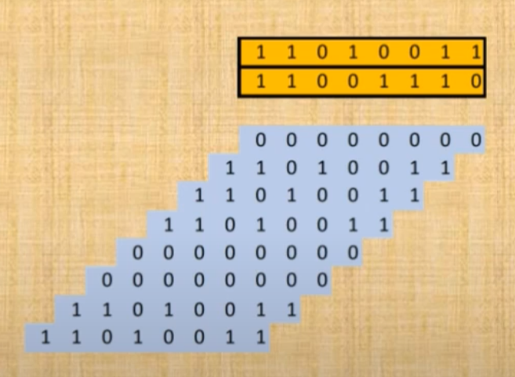
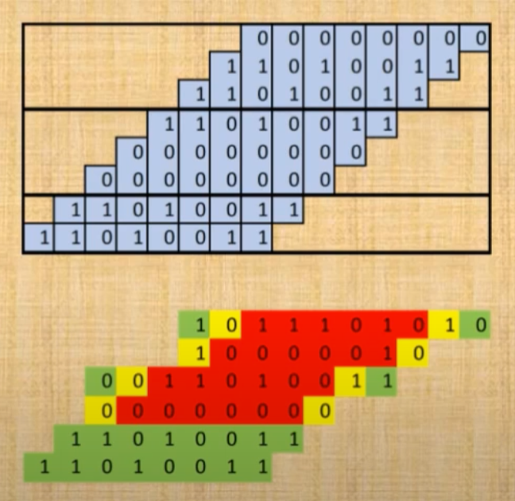
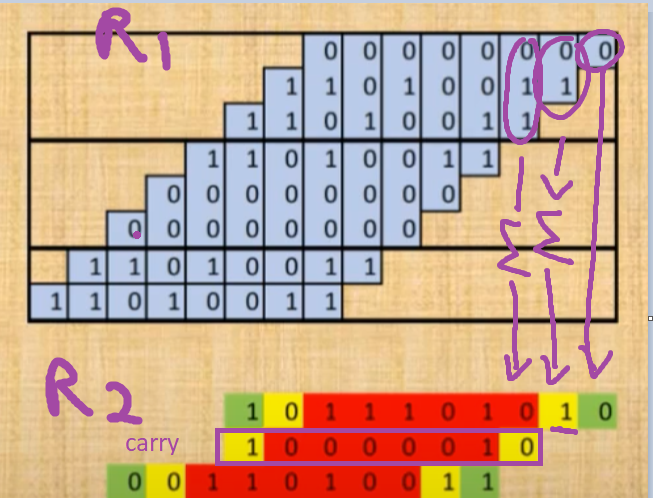
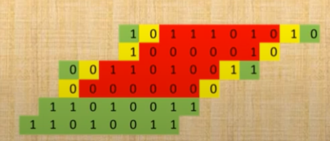
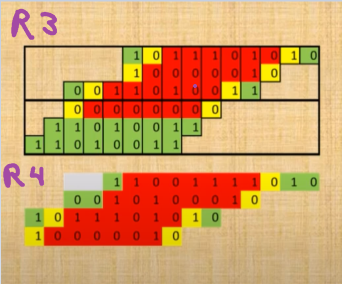
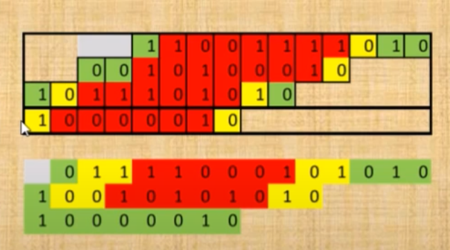
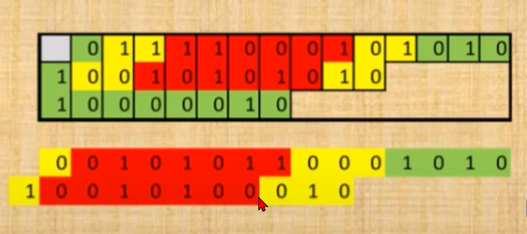
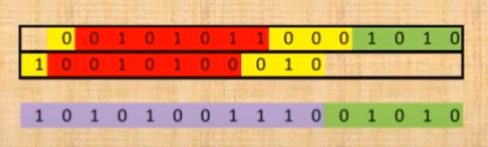

```json
{
    'nombre': 'Barrera Peña  Víctor Miguel',
    'tipo': 'Tarea',
    'no': '43',
    'grupo':  '6',
    'materia': '1645 Diseño Digital Moderno',
    'semestre': '2022-1',
    'enunciado': 'metodo de wallace tree para multiplicar' ,
    'fecha': '23-10-2021'
}
```

<style>
    body{
  text-align: justify;
}
    h1{
        font-weight: bold;
        text-align:center;
    }
    p::first-letter{
  font-size: 1.3rem;
}
 a{
  text-decoration: none;
}
</style>


La solución por método de Wallace Tree (árbol) es un método para obtener la multiplicación de  de números binarios mediante un método rápido.

Consiste en 3 pasos muy sencillos

1. Obtener la multiplicación parcial, es decir , multiplicar elemento por elemento, pero no realizar la suma.



- En amarillo están los dos operandos.
- En azul están el resultado de la multiplicaciones.
  - Nótese que el primer renglón sale 0's poruqe el primer bit del segundo operando es 0

2. Dividir en filas de 3 elementos, des arriba a abajo



- Cada división (divisiones de 3 en 3 filas) se va a sumar independintemente a las demás.


En cada división que tenga 3 filas realizamos la reducción



R1 es antes de la reducción

R2 es obtenido de la reducción

- La primera fila es la suma de la sección, del paso R1.
- La segunda fila es el carry de la suma de la fila 1
- La tercera fila ,es la misma 

Se realiza lo anterior con todas las secciones



Las ultimas 2 filas no se le aplica el proceso porque son sólo 2 filas en esta sección

## Obtenido la reducción R2

- R3 , partimos la R2 en secciones de 3 columans
- R4 volvemos a sumar como en R2, pero aquí es a partir de R3




## Otra vez



y por fin sólo quedan 3 columnas, y aqui ya es suma directa con sumador completo, pero se seguirá iterando


## Otra



## Paso 3 sumar



ya sólo sumas las dos filas y obtienes el resultado


# Referencias

*Wallace Tree Multiplier Presentation*. (2016, 18 abril). YouTube. https://www.youtube.com/watch?v=4-l_PGPog9o&t=386s

