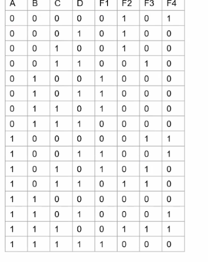
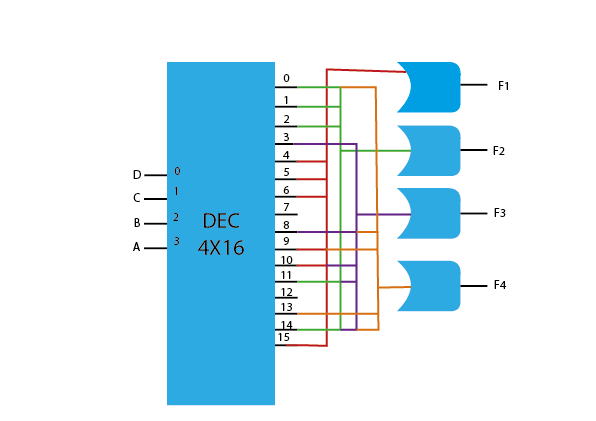

```json
{
    'nombre': 'Barrera Peña  Víctor Miguel',
    'tipo': 'Tarea',
    'no': '44',
    'grupo':  '6',
    'materia': '1645 Diseño Digital Moderno',
    'semestre': '2022-1',
    'enunciado': 'Implementar las siguientes funciones boleanas usando dec 4x16' ,
    'fecha': '25-10-2021'
}
```

<style>
    body{
  text-align: justify;
}
    h1{
        font-weight: bold;
        text-align:center;
    }
    p::first-letter{
  font-size: 1.3rem;
}
 a{
  text-decoration: none;
}
</style>
# Tabla de verdad



# Miniterminos

$$
\begin{aligned}
	F1= \sum_{(4,5,6,9,10,15)} \\
	F2= \sum_{(0,1,2,11,14)} \\
	F3= \sum_{(3,8,10,11,14)} \\
	F4= \sum_{(0,8,9,13,14)}
\end{aligned}
$$


# Implementación



# Referencias

- Diapositivas pág. 440, Roberto Mandujano
