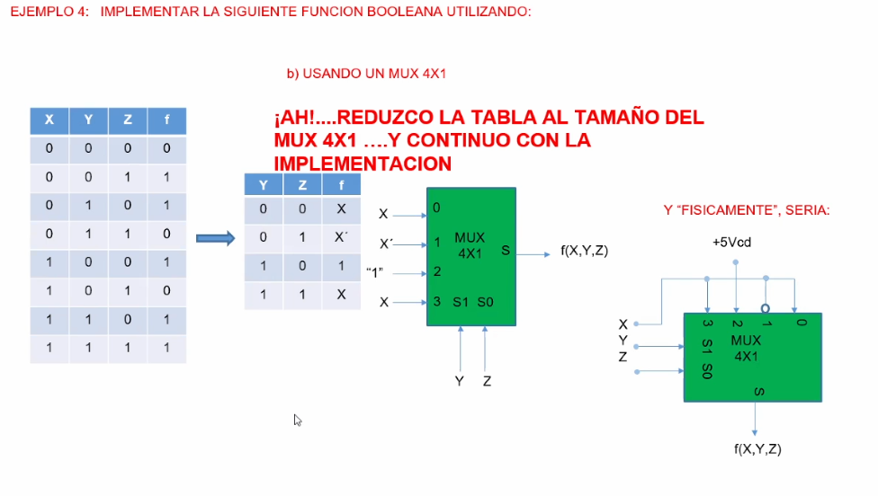
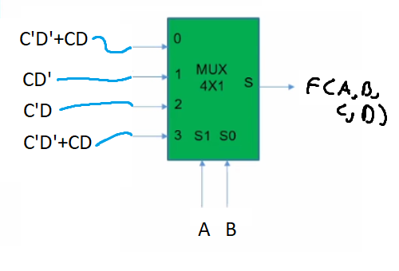
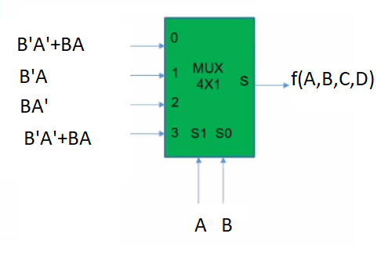

```json
{
    'nombre': 'Barrera Peña  Víctor Miguel',
    'tipo': 'Tarea',
    'no': '46',
    'grupo':  '6',
    'materia': '1645 Diseño Digital Moderno',
    'semestre': '2022-1',
    'enunciado': 'Diseñar un detector de múltiplos 3 en palabras de 4 Bits (A,B,C,D) utilizando  un Multiplexor 4 x1' ,
    'fecha': '23-10-2021'
}
```

<style>
    body{
  text-align: justify;
}
    h1{
        font-weight: bold;
        text-align:center;
    }
    p::first-letter{
  font-size: 1.3rem;
}
 a{
  text-decoration: none;
}
</style>
#  Ejemplo



En el ejemplo reducimos de una tabla de 3 variables a una de 2 variables, usamos como líneas de selección a YZ

# Diseñar un detector de múltiplos 3 en palabras de 4 Bits (A,B,C,D) utilizando  un Multiplexor 4 x1

- A) Usando como líneas de selección las variables A y B
- B) Usando como líneas de selección las variables C y D

## Tabla completa (INCISO A)

| A    | B    | C    | D    | F    |
| ---- | ---- | ---- | ---- | ---- |
| 0    | 0    | 0    | 0    | 1    |
| 0    | 0    | 0    | 1    | 0    |
| 0    | 0    | 1    | 0    | 0    |
| 0    | 0    | 1    | 1    | 1    |
| 0    | 1    | 0    | 0    | 0    |
| 0    | 1    | 0    | 1    | 0    |
| 0    | 1    | 1    | 0    | 1    |
| 0    | 1    | 1    | 1    | 0    |
| 1    | 0    | 0    | 0    | 0    |
| 1    | 0    | 0    | 1    | 1    |
| 1    | 0    | 1    | 0    | 0    |
| 1    | 0    | 1    | 1    | 0    |
| 1    | 1    | 0    | 0    | 1    |
| 1    | 1    | 0    | 1    | 0    |
| 1    | 1    | 1    | 0    | 0    |
| 1    | 1    | 1    | 1    | 1    |

Primero definimos la convención, en este caso si sale 1 a la salida quiere decir que es múltiplo de 3, en caso contrario 0.

### Reducción de D

| A    | B    | C    | F    |
| ---- | ---- | ---- | ---- |
| 0    | 0    | 0    | D'   |
| 0    | 0    | 1    | D    |
| 0    | 1    | 0    | 0    |
| 0    | 1    | 1    | D'   |
| 1    | 0    | 0    | D    |
| 1    | 0    | 1    | 0    |
| 1    | 1    | 0    | D'   |
| 1    | 1    | 1    | D    |

### Reducción de C

| A    | B    | F       |
| ---- | ---- | ------- |
| 0    | 0    | C'D'+CD |
| 0    | 1    | CD'     |
| 1    | 0    | C'D     |
| 1    | 1    | C'D'+CD |

### Implementación



## Tabla completa (INCISO B)

| A    | B    | C    | D    | F    |
| ---- | ---- | ---- | ---- | ---- |
| 0    | 0    | 0    | 0    | 1    |
| 0    | 0    | 0    | 1    | 0    |
| 0    | 0    | 1    | 0    | 0    |
| 0    | 0    | 1    | 1    | 1    |
| 0    | 1    | 0    | 0    | 0    |
| 0    | 1    | 0    | 1    | 0    |
| 0    | 1    | 1    | 0    | 1    |
| 0    | 1    | 1    | 1    | 0    |
| 1    | 0    | 0    | 0    | 0    |
| 1    | 0    | 0    | 1    | 1    |
| 1    | 0    | 1    | 0    | 0    |
| 1    | 0    | 1    | 1    | 0    |
| 1    | 1    | 0    | 0    | 1    |
| 1    | 1    | 0    | 1    | 0    |
| 1    | 1    | 1    | 0    | 0    |
| 1    | 1    | 1    | 1    | 1    |

Primero definimos la convención, en este caso si sale 1 a la salida quiere decir que es múltiplo de 3, en caso contrario 0.

### Reducción de A

| B    | C    | D    | F    |
| ---- | ---- | ---- | ---- |
| 0    | 0    | 0    | A'   |
| 0    | 0    | 1    | A    |
| 0    | 1    | 0    | 0    |
| 0    | 1    | 1    | A'   |
| 1    | 0    | 0    | A    |
| 1    | 0    | 1    | 0    |
| 1    | 1    | 0    | A'   |
| 1    | 1    | 1    | A    |

### Reducción de B

| C    | D    | F       |
| ---- | ---- | ------- |
| 0    | 0    | B'A'+BA |
| 0    | 1    | B'A     |
| 1    | 0    | BA'     |
| 1    | 1    | B'A'+BA |


### Implementación


