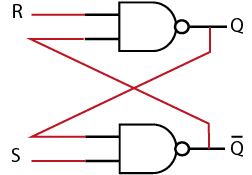

```json
{
    'nombre': 'Barrera Peña  Víctor Miguel',
    'tipo': 'Tarea',
    'no': '48',
    'grupo':  '6',
    'materia': '1645 Diseño Digital Moderno',
    'semestre': '2022-1',
    'enunciado': 'Como funciona un flip flop rs con compuertas nand',
    'fecha': '30-10-22'
}
```

<style>
    body{
  text-align: justify;
}
    h1{
        font-weight: bold;
        text-align:center;
    }
    p::first-letter{
  font-size: 1.3rem;
}
 a{
  text-decoration: none;
}
</style>


# Diagrama




# Tabla

| S    | R    | Q    | Q´   | Acción    |
| ---- | ---- | ---- | ---- | --------- |
| 0    | 0    | x    | x    | No valida |
| 0    | 1    | 0    | 1    | Apaga     |
| 1    | 0    | 1    | 0    | Enciende  |
| 1    | 1    | Q    | Q'   | Mantiene  |


# Referencias

- Diapositivas Roberto Mandujano página 628,2022-1
- Ilustración hecha por Victor Miguel B.P.
- *FLIP FLOP RS CON COMPUERTAS NAND (74LS00)*. (2021, 13 enero). YouTube. https://www.youtube.com/watch?v=3XpG7D1KWmk
  - Esta mal
