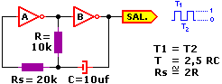

```json
{
    'nombre': 'Barrera Peña  Víctor Miguel',
    'tipo': 'Tarea',
    'no': '50',
    'grupo':  '6',
    'materia': '1645 Diseño Digital Moderno',
    'semestre': '2022-1',
    'enunciado': 'Oscilador con compertas not',
    'fecha': '30-10-22'
}
```

<style>
    body{
  text-align: justify;
}
    h1{
        font-weight: bold;
        text-align:center;
    }
    p::first-letter{
  font-size: 1.3rem;
}
 a{
  text-decoration: none;
}
</style>


# Consideraciones de la siguiente tarea

- En lo personal, leí dos artículos y el siguiente me pareció excelentemente escrito, describe todo lo que hay que saber para usar el circuito, por lo cual la copiare textualmente.

# Explicación

Descripción:

Suponte que en determinado momento la salida del inversor B está a nivel "1", entonces su entrada esta a "0", y la entrada del inversor "A" a nivel "1". En esas condiciones **C** se carga a través de **R**, y los inversores permanecen en ese estado.

Cuando el capacitor alcanza su carga máxima, se produce la conmutación del inversor "A". Su entrada pasa a "0", su salida a "1" y la salida del inversor "B" a "0", se invierte la polaridad del capacitor y este se descarga, mientras tanto los inversores permanecen sin cambio, una vez descargado, la entrada del inversor "A" pasa nuevamente a "1", y comienza un nuevo ciclo.

Este oscilador es simétrico ya que el tiempo que dura el nivel alto es igual al que permanece en nivel bajo, este tiempo esta dado por **T = 2,5 R C**

**T** expresado en segundos
**R** en Ohms
**C** en Faradios

Creo yo que fue fácil y sencillo hacerlo, ahora bien, si recordamos aquello de [**las leyes de De Morgan**](http://r-luis.xbot.es/edigital/ed05.html) sabrás que uniendo las entradas de compuertas NAND o compuertas NOR obtienes la misma función que los inversores o compuertas NOT.



# Referencias

- Diapositivas Roberto Mandujano página 628,2022-1
- *Electrónica Digital - Osciladores - Parte I.* (s. f.). R.Ruis. http://r-luis.xbot.es/edigital/ed07.html#:%7E:text=.%3A%20Oscilador%20Sim%C3%A9trico%20con%20compuertas%20NOT&text=Descripci%C3%B3n%3A,%22%20a%20nivel%20%221%22.&text=Cuando%20el%20capacitor%20alcanza%20su,conmutaci%C3%B3n%20del%20inversor%20%22A%22.
